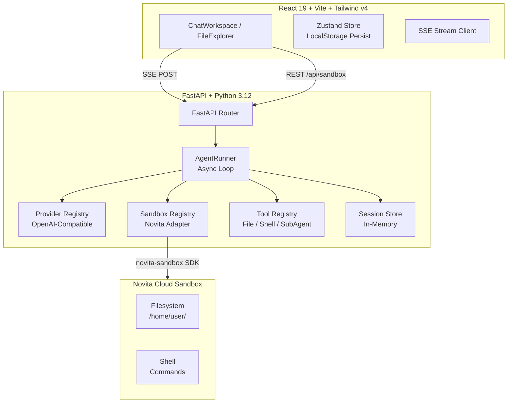

<div align="center">

# 🧠 OpenCurro — AI Agent Studio

<div>
  
  
  
  
  
  
</div>

<br />

<strong>A production-grade autonomous AI agent that writes, reads, and edits files inside a secure cloud sandbox.</strong>

<br />
<br />

<a href="#-overview">Overview</a> •
<a href="#-architecture">Architecture</a> •
<a href="#-quick-start">Quick Start</a> •
<a href="#-directory-structure">Directory Structure</a> •
<a href="#-api-endpoints">API Endpoints</a> •
<a href="#-deployment">Deployment</a>

</div>

---

## 📋 Overview

**OpenCurro** (formerly Novita Agent Studio) is a full-stack web application that lets you run an autonomous AI coding agent inside a secure Novita cloud sandbox. The agent can:

- 📂 **List, read, and write files** in a sandboxed workspace (`/home/user/`)
- 🖥️ **Execute shell commands** (install packages, run scripts, build projects)
- 🔍 **Use a DeepExplorer sub-agent** for thorough codebase analysis
- 🔄 **Stream responses token-by-token** via Server-Sent Events
- 💬 **Persist chat history** across sessions (browser Local Storage)

### Supported LLM Providers

| Provider | Base URL |
|----------|----------|
| [OpenRouter](https://openrouter.ai) | `https://openrouter.ai/api/v1` |
| [Groq](https://groq.com) | `https://api.groq.com/openai/v1` |
| [NVIDIA NIM](https://www.nvidia.com/en-us/ai/) | `https://integrate.api.nvidia.com/v1` |

---

## 🏗 Architecture



### Data Flow

```
User Message → Composer → SSE POST /api/chat/stream
  → AgentRunner starts async generator
  → Sandbox auto-created (if first turn)
  → Provider LLM called with tools schema
  → Token-by-token SSE: "token", "tool_call", "tool_result", "message_complete"
  → Tool calls executed inside Novita sandbox
  → Full history persisted in backend SessionStore
  → Frontend renders tokens via Zustand → component re-render
```

---

## 🚀 Quick Start

### Prerequisites

- **Node.js** 20+ (or **Bun**)
- **Python** 3.12+
- **Novita API Key** from [Novita AI](https://novita.ai)
- **OpenRouter / Groq / NVIDIA NIM API Key**

### 1. Backend Setup

```bash
cd backend
python -m venv .venv
source .venv/bin/activate  # On Windows: .venv\Scripts\activate
pip install -r requirements.txt
uvicorn src.main:app --reload --port 8000
```

Or with `uv` (recommended for Python 3.12+):

```bash
cd backend
uv venv .venv --python 3.12
source .venv/bin/activate
uv pip install -r requirements.txt
uvicorn src.main:app --reload --port 8000
```

The backend runs on `http://localhost:8000`. Health check: `curl http://localhost:8000/health`

### 2. Frontend Setup

```bash
cd frontend
npm install     # or: bun install
npm run dev     # or: bun run dev
```

The frontend runs on `http://localhost:5173` with Vite proxying `/api` to the backend.

### 3. Configuration

Set the backend URL in `frontend/.env`:

```env
VITE_BACKEND_URL=    # Empty = use Vite proxy (dev); or set to http://localhost:8000
```

Open the app → click the ⚙️ Settings button → enter:
- **OpenRouter / Groq / NVIDIA NIM** API keys
- **Novita** API key (for sandbox)
- Select a provider and model → click "Fetch models"

---

## 📁 Directory Structure

```
OpenCurro/
├── backend/                  # FastAPI Python backend
│   ├── src/
│   │   ├── main.py           # FastAPI app entry, CORS, router mounts
│   │   ├── api/              # REST API route handlers
│   │   │   ├── chat.py       # POST /session, POST /stream
│   │   │   ├── providers.py  # GET /providers, POST /providers/models
│   │   │   └── sandbox.py    # GET /files, GET /file-content, POST /file-content
│   │   ├── agents/           # Core agent logic
│   │   │   ├── agent.py      # AgentRunner — main event loop
│   │   │   ├── providers/    # LLM provider abstraction
│   │   │   │   ├── base.py              # Protocol: LLMProvider, ProviderStreamDelta
│   │   │   │   ├── openai_compatible.py # OpenAI-compatible adapter
│   │   │   │   └── registry.py          # ProviderRegistry (OpenRouter, Groq, NVIDIA)
│   │   │   ├── sandbox/      # Sandbox provider abstraction
│   │   │   │   ├── base.py              # Protocol: SandboxAdapter, SandboxContext
│   │   │   │   ├── novita.py            # Novita sandbox implementation
│   │   │   │   └── registry.py          # SandboxRegistry
│   │   │   ├── tools/        # AI tool definitions and handlers
│   │   │   │   ├── registry.py          # ToolRegistry — schema + handler mapping
│   │   │   │   ├── file_read.py         # Read files
│   │   │   │   ├── file_write.py        # Write/create files
│   │   │   │   ├── list_files.py        # List directory contents
│   │   │   │   ├── shall_tool.py        # Execute shell commands
│   │   │   │   └── call_sub_agent.py    # Invoke sub-agent
│   │   │   ├── subagents/    # Specialized sub-agents
│   │   │   │   ├── __init__.py          # SubAgent registry
│   │   │   │   └── deepexplorer/        # Codebase exploration sub-agent
│   │   │   │       ├── agent.py         # DeepExplorer loop (read-only, list+read)
│   │   │   │       └── systemprompt.py  # DeepExplorer system prompt
│   │   │   └── systemprompts/
│   │   │       └── systemprompt.py      # Main agent system prompt
│   │   ├── core/
│   │   │   └── config.py     # Pydantic Settings (env vars, defaults)
│   │   ├── schemas/          # Pydantic models
│   │   │   ├── chat.py       # ChatMessage, ChatStreamRequest, SSEEvent
│   │   │   ├── providers.py  # ProviderMetadata, ProviderModel, ProviderType
│   │   │   └── sandbox.py    # SandboxSettings, FileTreeNode, ToolExecutionResult
│   │   ├── services/
│   │   │   └── session_store.py  # In-memory ChatSessionState store
│   │   └── tests/            # Pytest unit tests
│   ├── requirements.txt
│   └── .gitignore
├── frontend/                 # React 19 + Vite + TypeScript
│   ├── src/
│   │   ├── main.tsx          # React entry point
│   │   ├── App.tsx           # Root layout, mobile tabs, sidebar
│   │   ├── app/routes/
│   │   │   └── route.ts      # Route constants
│   │   ├── components/
│   │   │   ├── chat/         # Chat components
│   │   │   │   ├── ChatWorkspace.tsx    # Main chat panel, message list
│   │   │   │   ├── Composer.tsx         # Textarea input + send button
│   │   │   │   ├── HistorySidebar.tsx   # Chat history sidebar
│   │   │   │   └── SubAgentOutput.tsx   # Sub-agent modal display
│   │   │   ├── files/        # File explorer components
│   │   │   │   ├── FileExplorer.tsx     # Tree view of sandbox files
│   │   │   │   └── FileViewer.tsx       # Code viewer with inline editing
│   │   │   ├── settings/
│   │   │   │   └── SettingsModal.tsx    # API key & model settings
│   │   │   └── ui/
│   │   │       └── button.tsx           # shadcn/ui Button component
│   │   ├── hooks/
│   │   │   ├── useAgentChat.ts          # SSE stream orchestrator
│   │   │   └── useProviders.ts          # Provider/model fetching
│   │   ├── lib/
│   │   │   ├── api.ts                   # REST & SSE client
│   │   │   ├── env.ts                   # Environment variable access
│   │   │   └── utils.ts                 # cn() utility
│   │   ├── store/
│   │   │   ├── useChatStore.ts          # Zustand chat state (persisted)
│   │   │   └── useSettingsStore.ts      # Zustand settings state (persisted)
│   │   ├── types/
│   │   │   ├── chat.ts                  # ChatRecord, UiMessage, ToolChip, etc.
│   │   │   ├── provider.ts             # ProviderMetadata, ProviderModel
│   │   │   └── sandbox.ts              # FileTreeNode, SandboxFilesResponse
│   │   ├── utils/
│   │   │   └── id.ts                   # Unique ID generator
│   │   └── index.css                    # Tailwind v4 + custom theme
│   ├── public/
│   │   └── _redirects                   # SPA fallback for deployment
│   ├── vite.config.ts                   # Vite config with proxy
│   ├── tsconfig*.json                   # TypeScript config
│   ├── eslint.config.js                 # ESLint flat config
│   └── components.json                  # shadcn/ui config
├── specs/                    # Specification documents
│   ├── spec.md               # Master specification
│   ├── agent-runtime/        # Agent loop spec
│   ├── frontend-workspace/   # Frontend UI spec
│   ├── provider-management/  # Provider system spec
│   └── sandbox-integration/  # Sandbox integration spec
├── Dockerfile                # Multi-stage production Dockerfile
├── Dockerfile.base           # Base image for faster Docker builds
├── package.json              # Workspace root
└── .gitignore
```

---

## 🌐 API Endpoints

| Method | Endpoint | Description |
|--------|----------|-------------|
| `GET` | `/health` | Health check → `{ "status": "healthy" }` |
| `GET` | `/api/providers` | List supported LLM providers |
| `POST` | `/api/providers/models` | Fetch models for a provider (requires API key) |
| `POST` | `/api/chat/session` | Create or rehydrate a chat session |
| `POST` | `/api/chat/stream` | **SSE endpoint** — send message, stream response |
| `GET` | `/api/sandbox/files` | List sandbox file tree |
| `GET` | `/api/sandbox/file-content` | Read file content from sandbox |
| `POST` | `/api/sandbox/file-content` | Write file content in sandbox |

### SSE Event Types (`POST /api/chat/stream`)

| Event | Data | Description |
|-------|------|-------------|
| `status` | `{ state, label }` | Status updates (creating sandbox, thinking) |
| `iteration` | `{ current, limit }` | Current iteration counter |
| `sandbox` | `{ sandbox_id, provider, root_path }` | Sandbox created |
| `token` | `{ value }` | Streaming text token |
| `tool_call` | `{ name, file_path, command, label }` | Tool call started |
| `tool_result` | `{ name, file_path, ok, result }` | Tool execution result |
| `message_complete` | `{ content, iteration_count }` | Full message assembled |
| `subagent_start` | `{ session, agent }` | Sub-agent session started |
| `subagent_token` | `{ session, value }` | Sub-agent streaming token |
| `subagent_tool_call` | `{ session, name, ... }` | Sub-agent tool call |
| `subagent_tool_result` | `{ session, name, ok, result }` | Sub-agent tool result |
| `subagent_complete` | `{ session }` | Sub-agent finished |
| `subagent_error` | `{ session, message }` | Sub-agent error |
| `error` | `{ message, code }` | Error occurred |
| `done` | `{ ok }` | Stream completed |

---

## 🧩 Key Design Decisions

### Agent Loop (`backend/src/agents/agent.py`)
- Async generator yields SSE events token-by-token
- Tool calls interrupt text streaming; results are appended to session memory
- Max 1000 iterations per user message (configurable via `max_iterations`)
- `parallel_tool_calls: false` for predictable sandbox mutations

### Tool System (`backend/src/agents/tools/`)
- Tools use OpenAI-compatible `function` schema
- Handlers receive `sandbox_adapter` + `sandbox_context` for sandbox ops
- Structured `ToolExecutionResult` with `ok`, `data`, `error` fields

### Sandbox Abstraction (`backend/src/agents/sandbox/`)
- Protocol-based design — easy to add new sandbox providers
- Novita adapter uses `novita-sandbox` SDK with 1-hour timeout, pause/auto-resume
- All file paths validated under `/home/user/`

### Frontend State (`frontend/src/store/`)
- **useChatStore**: Chat list, messages, tool chips, sub-agent state — persisted via `zustand/middleware/persist`
- **useSettingsStore**: API keys, provider/model selection — persisted separately

### SSE Client (`frontend/src/lib/api.ts`)
- Raw `fetch` + `ReadableStream` reader — no external SSE library
- Manual SSE parsing with event name + data line extraction

---

## 🧪 Testing

```bash
# Backend tests
cd backend
pytest -v

# Frontend lint + typecheck
cd frontend
npm run lint
npm run build   # tsc + vite build
```

---

## 🐳 Deployment

### Docker (Multi-stage)

```bash
docker build -t opencurro .
docker run -p 8000:8000 opencurro
```

The production image:
1. Builds frontend with `npm run build`
2. Installs Python deps, copies backend source
3. Serves built frontend as static files from FastAPI
4. Runs with non-root user on port 8000

### Environment Variables

| Variable | Default | Description |
|----------|---------|-------------|
| `APP_NAME` | `Novita Agent Studio API` | FastAPI title |
| `API_PREFIX` | `/api` | API route prefix |
| `CORS_ORIGINS` | `["*"]` | Allowed CORS origins |
| `MAX_ITERATION_LIMIT` | `1000` | Max agent iterations per turn |
| `SANDBOX_ROOT_PATH` | `/home/user` | Sandbox filesystem root |
| `DEFAULT_SANDBOX_TIMEOUT_SECONDS` | `3600` | Sandbox timeout |

---

## 📚 Specs

Detailed specification documents are in [`specs/`](./specs/):

| Document | Description |
|----------|-------------|
| [`spec.md`](./specs/spec.md) | Master specification, architecture rules, feature table |
| [`agent-runtime/document.md`](./specs/agent-runtime/document.md) | Agent loop, SSE streaming, session memory |
| [`frontend-workspace/document.md`](./specs/frontend-workspace/document.md) | React UI, stores, persistence |
| [`provider-management/document.md`](./specs/provider-management/document.md) | LLM provider abstraction, model discovery |
| [`sandbox-integration/document.md`](./specs/sandbox-integration/document.md) | Sandbox adapter, file tools, path validation |

---

## 📄 License

This project is open source. See the repository for license details.

---

<div align="center">
  <sub>Built with ❤️ using React, FastAPI, and Novita Sandbox</sub>
</div>
