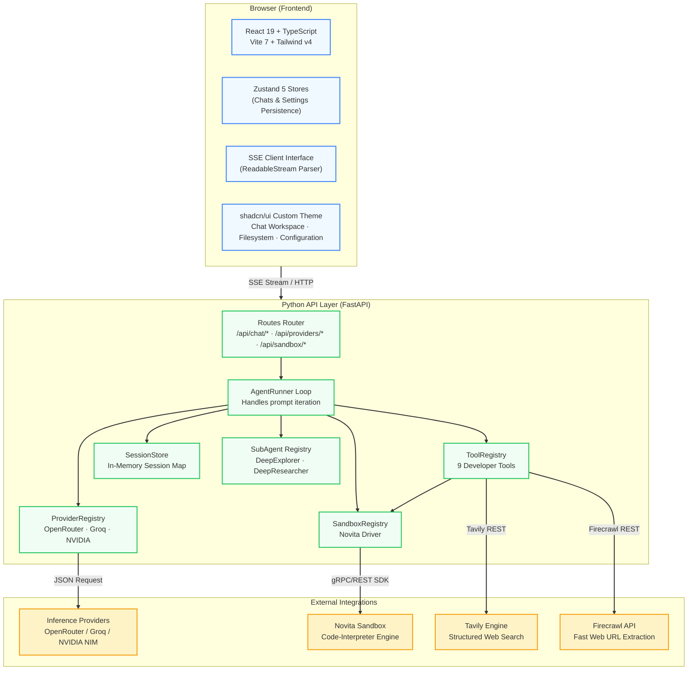
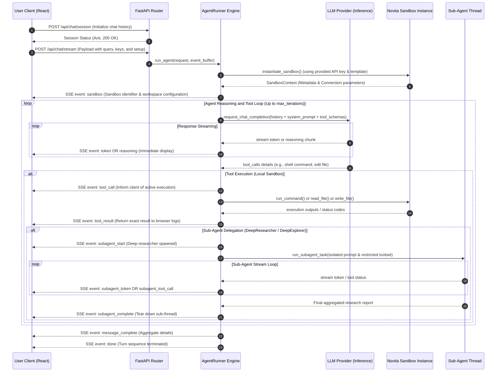

<div align="center">
  <br/>
  <pre style="
    font-family: 'SF Mono', 'Fira Code', 'Cascadia Code', monospace;
    font-size: 13px;
    line-height: 1.5;
    background: #1a1a2e;
    color: #e0e0e0;
    padding: 24px 28px;
    border-radius: 16px;
    display: inline-block;
    text-align: left;
    letter-spacing: 0.3px;
    box-shadow: 0 8px 32px rgba(0,0,0,0.3);
    border: 1px solid #2a2a4a;
  "><span style="color:#ffc700;font-weight:bold;">  ╔══════════════════════════════════════════════╗</span>
<span style="color:#ffc700;font-weight:bold;">  ║</span>  <span style="color:#a855f7;font-weight:bold;">   ██████╗ ██████╗ ██████╗ ██████╗ ██████╗   </span>  <span style="color:#ffc700;font-weight:bold;">║</span>
<span style="color:#ffc700;font-weight:bold;">  ║</span>  <span style="color:#a855f7;font-weight:bold;">  ██╔══██╗██╔══██╗██╔══██╗██╔══██╗██╔══██╗  </span>  <span style="color:#ffc700;font-weight:bold;">║</span>
<span style="color:#ffc700;font-weight:bold;">  ║</span>  <span style="color:#a855f7;font-weight:bold;">  ██████╔╝██████╔╝██████╔╝██████╔╝██████╔╝  </span>  <span style="color:#ffc700;font-weight:bold;">║</span>
<span style="color:#ffc700;font-weight:bold;">  ║</span>  <span style="color:#a855f7;font-weight:bold;">  ██╔═══╝ ██╔══██╗██╔══██╗██╔══██╗██╔══██╗  </span>  <span style="color:#ffc700;font-weight:bold;">║</span>
<span style="color:#ffc700;font-weight:bold;">  ║</span>  <span style="color:#a855f7;font-weight:bold;">  ██║     ██║  ██║██║  ██║██║  ██║██║  ██║  </span>  <span style="color:#ffc700;font-weight:bold;">║</span>
<span style="color:#ffc700;font-weight:bold;">  ║</span>  <span style="color:#a855f7;font-weight:bold;">  ╚═╝     ╚═╝  ╚═╝╚═╝  ╚═╝╚═╝  ╚═╝╚═╝  ╚═╝  </span>  <span style="color:#ffc700;font-weight:bold;">║</span>
<span style="color:#ffc700;font-weight:bold;">  ╚══════════════════════════════════════════════╝</span>

  <span style="color:#22c55e;">▸</span> <span style="color:#a1a1aa;">Production-grade autonomous AI agent workspace</span>
  <span style="color:#22c55e;">▸</span> <span style="color:#a1a1aa;">Sandboxed file operations · Shell execution · Web search</span>
  <span style="color:#22c55e;">▸</span> <span style="color:#a1a1aa;">Powered by</span> <span style="color:#f97316;">OpenRouter</span><span style="color:#a1a1aa;"> / </span><span style="color:#f97316;">Groq</span><span style="color:#a1a1aa;"> / </span><span style="color:#f97316;">NVIDIA NIM</span>
  <span style="color:#22c55e;">▸</span> <span style="color:#a1a1aa;">Runtime:</span> <span style="color:#3b82f6;">Python 3.14</span> <span style="color:#a1a1aa;">+</span> <span style="color:#38bdf8;">FastAPI</span> <span style="color:#a1a1aa;">·</span> <span style="color:#3b82f6;">React 19</span> <span style="color:#a1a1aa;">+</span> <span style="color:#38bdf8;">Vite 7</span>
  <span style="color:#22c55e;">▸</span> <span style="color:#a1a1aa;">Sandbox:</span> <span style="color:#38bdf8;">Novita</span>
</pre>
  <br/>
</div>

<!-- BADGES -->
<p align="center">
  
  
  
  
  
  
  
  
</p>

---

## 📖 Overview

**OpenCurro** (also styled as **Novita Agent Studio**) is a highly engineered, production-ready full-stack web application designed to run an autonomous AI software developer and researcher inside an **isolated Novita sandbox**.

The core system orchestrates a powerful **tool-calling agent loop** that can interact with the environment, execute shell operations, fetch/parse web materials, edit files with high precision, and recursively delegate complex investigative subtasks to highly specialized sub-agents. The user-facing experience offers a fluid, real-time chat window alongside a sandbox file system navigator and an interactive file viewer/editor.

---

## ✨ Features

<table>
<tr>
<td width="50%">

### 🧠 Agent Loop & Core Capabilities
- **Autonomous Multi-Step Execution**: Runs continuous tool-execution loops (up to 1,000 iterations per prompt) with full recovery behaviors.
- **SSE Streaming Protocol**: Delivers immediate token streaming, raw thinking process visibility (`reasoning_content`), and nested tool status tracking.
- **Deep Delegation via Sub-Agents**: Hand off highly investigative or parallel queries to specialized, task-restricted sub-agents.
- **Structured Error Containment**: Robust path validation and error capture prevent the agent from exiting unexpectedly or leaking file-system bounds.

</td>
<td width="50%">

### 🖥️ High-Fidelity Frontend Experience
- **Fluid Split-Workspace UI**: Beautiful responsive layout with instant pane resizing. Mobile view converts gracefully into tabbed navigation.
- **Real-Time Terminal Renderers**: Collapsible outputs for shell tools, command state representation, and background task outputs.
- **Interactive File Tree Explorer**: Real-time listing of sandboxed files with file reading, content modification, and writing.
- **Zustand 5 Persisted Store**: Retains all conversation records, provider configurations, and application variables locally.

</td>
</tr>
<tr>
<td width="50%">

### 🔧 Extensible Backend Architecture
- **Clean Registry Pattern**: Built to be modified. Add or alter LLM providers, sandbox drivers, or custom developer tools with zero boilerplate.
- **Protocol-Oriented Contracts**: System components conform to defined Python `Protocols` for strong typing and loose architectural coupling.
- **Stateless Session Routing**: Memory sessions manage real-time event streams and background tasks without database overhead.
- **Secure File Normalization**: Strict path containment checks block unauthorized filesystem actions outside the `/home/user` workspace root.

</td>
<td width="50%">

### 🔌 Multi-Provider Support
- **Flexible Providers**: Native support for **OpenRouter**, **Groq**, and **NVIDIA NIM** models.
- **Bring Your Own Keys**: Key details are managed client-side in secure Zustand storage, maintaining a lightweight and private backend posture.
- **Advanced Sandbox Parameters**: Configurable sandbox template IDs, startup options, and idle-timeout intervals.

</td>
</tr>
</table>

---

## 🏗️ Architecture & Interactions

OpenCurro splits responsibilities between a client-side state engine and a stateless event-driven backend. The system connects to various external API layers to facilitate computation and data extraction.

### System Components



### Complete End-to-End Execution Sequence

This sequence diagram details how user commands flow through the client, trigger the backend agent loop, run sandboxed tools, use sub-agents, and continuously stream back tokens.



---

## 🧰 Agent Tool Belt

The primary AgentRunner is equipped with **9 foundational tools** giving it broad capabilities to operate as a developer:

| Tool Name | Purpose | Target / Operation |
|---|---|---|
| `file_read` | Access file contents | Absolute path read with unicode decoding safety. |
| `file_write` | Output file contents | Create or overwrite files, automatically ensuring parent folders exist. |
| `str_replace` | Exact target replacement | Make surgical edits in files via matching string blocks to prevent file corruption. |
| `list_files` | Folder index visualization | Retrieve structured list of folders and files including metadata (depth bounded). |
| `shall_tool` | Shell command trigger | Run build scripts, package managers, testing, or binary execution (foreground/background). |
| `shell_view` | Output watcher | View stdout/stderr of active background command execution handles. |
| `web_search` | Target-specific Web search | Query the internet via Tavily for current documentation, updates, and articles. |
| `fatch_web_urls` | Full webpage scraper | Retrieve clean markdown conversions of target urls using Firecrawl. |
| `call_sub_agent` | Task partitioning | Delegate a multi-step investigation to specialized DeepExplorer or DeepResearcher agents. |

---

## 🤖 Sub-Agents Specification

When the main agent loop encounters multi-faceted tasks that require intensive, iterative steps (such as gathering long-form documentation or exhaustively browsing nested directories), it can call `call_sub_agent`.

```
                  ┌──────────────────────┐
                  │    AgentRunner       │
                  └──────────┬───────────┘
                             │
                    [call_sub_agent]
                             │
            ┌────────────────┴────────────────┐
            ▼                                 ▼
┌───────────────────────┐         ┌───────────────────────┐
│     DeepExplorer      │         │    DeepResearcher     │
├───────────────────────┤         ├───────────────────────┤
│ Target: Read-Only Code│         │ Target: Web Research  │
│ Analysis & Exploration│         │ & Material Aggregation│
├───────────────────────┤         ├───────────────────────┤
│ Allowed Tools:        │         │ Allowed Tools:        │
│ - list_files          │         │ - web_search          │
│ - file_read           │         │ - fatch_web_urls      │
│                       │         │ - file_write          │
│                       │         │ - list_files          │
│                       │         │ - shall_tool          │
└───────────────────────┘         └───────────────────────┘
```

1. **DeepExplorer**: Designed for secure, zero-risk source code auditing, static analysis, and structure searching. Uses only read-only workspace tools.
2. **DeepResearcher**: Tailored for market intelligence, library documentation discovery, and write-ups. Enabled to browse, scrape, run commands, and write reports directly back to the workspace.

---

## 📁 Repository Anatomy

```
opencurro/                             # Workspace Root
├── backend/                           # fastapi backend project directory
│   ├── src/
│   │   ├── main.py                    # Server startup, routing composition, CORS configs
│   │   ├── core/                      # Configuration module
│   │   ├── schemas/                   # Pydantic schemas for REST & SSE exchange
│   │   ├── api/                       # API Route definitions partitioned by duty
│   │   ├── services/                  # Session tracking and memory stores
│   │   ├── agents/                    # Main agent orchestrators and providers
│   │   │   ├── agent.py               # Main AgentRunner tool-calling stream loop
│   │   │   ├── providers/             # LLM API abstraction classes
│   │   │   ├── sandbox/               # Novita sandbox execution adapters
│   │   │   ├── tools/                 # Implementations of 9 agent capabilities
│   │   │   ├── subagents/             # DeepExplorer & DeepResearcher agents
│   │   │   └── systemprompts/         # System constraints and instructions
│   │   └── tests/                     # Test suite
│   ├── requirements.txt               # Backend dependencies
│   └── README.md                      # Backend manual
├── frontend/                          # react UI project directory
│   ├── src/
│   │   ├── main.tsx                   # React root mount and directives
│   │   ├── App.tsx                    # Layout manager and reactive frame
│   │   ├── components/                # Partitioned reusable React components
│   │   │   ├── chat/                  # Composer, messages, and custom tool chips
│   │   │   ├── files/                 # Sandbox explorer and file editor
│   │   │   ├── settings/              # Settings modal with model provider parameters
│   │   │   └── ui/                    # Basic styled buttons and form controls
│   │   ├── store/                     # Zustand stores with state serialization
│   │   ├── hooks/                     # Custom orchestrator hooks (useAgentChat, useProviders)
│   │   ├── lib/                       # API communication and environment bindings
│   │   ├── types/                     # TypeScript structural interfaces
│   │   └── index.css                  # Tailwind v4 globals and responsive theme definitions
│   ├── package.json                   # Build recipes and frontend packages
│   └── README.md                      # Frontend manual
├── Dockerfile                         # Production-grade multi-stage Docker build recipe
├── Dockerfile.base                    # Pre-cached standard dependencies layer
├── start.sh                           # Development startup supervisor script
├── stop.sh                            # Development teardown helper script
└── README.md                          # Main repository manual (this file)
```

---

## 🚀 Getting Started

### Prerequisites

Ensure you have the following installed on your host system:
- **Python 3.14+** (Recommended) or Python 3.12+
- **Node.js 20+** and **npm** or **bun**
- **Docker** (Optional, for quick containerized deployment)

### 1. Backend Setup

First, navigate to the backend directory, configure your virtual environment, and install dependencies:

```bash
cd backend
python3 -m venv venv
source venv/bin/activate
pip install -r requirements.txt
```

Start the ASGI development server with live reloading:

```bash
uvicorn src.main:app --reload --port 8000
```

*The backend API will now be listening at `http://localhost:8000`.*

### 2. Frontend Setup

In a new terminal, navigate to the frontend directory, install npm packages, and start the Vite development server:

```bash
cd frontend
npm install
npm run dev
```

*The UI dev server will launch at `http://localhost:5173`. Vite will automatically proxy `/api` routes directly to the backend on `localhost:8000`.*

---

## 🐳 Containerized Production Deployment

OpenCurro is packaged with a high-efficiency, multi-stage `Dockerfile` that bundles both the compiled React frontend assets (served statically) and the FastAPI server under a single container footprint.

To build and run the production-ready image locally:

```bash
# Build the production image
docker build -t opencurro:latest .

# Spin up the container
docker run -d \
  -p 8000:8000 \
  --name opencurro-instance \
  opencurro:latest
```

Once running, navigate to `http://localhost:8000` in your web browser to access the complete application.

---

## 🔧 Environment Variables Reference

System variables are parsed on startup via Pydantic Settings. You can declare these in a `.env` file within the `backend/` directory or pass them directly through your shell environment:

| Variable Name | Default Value | Description |
|---|---|---|
| `APP_NAME` | `"Novita Agent Studio API"` | The visual branding name returned to the UI. |
| `API_PREFIX` | `"/api"` | Base path prefix for all routing definitions. |
| `CORS_ORIGINS` | `["*"]` | Cross-Origin resource sharing control array. |
| `MAX_ITERATION_LIMIT` | `1000` | Safety ceiling to prevent loop-runaway on LLM errors. |
| `SANDBOX_ROOT_PATH`| `"/home/user"` | Root constraint for sandbox operations. |
| `DEFAULT_SANDBOX_TIMEOUT_SECONDS` | `3600` | Expiration lifespan for newly created sandboxes. |
| `TAVILY_API_KEY` | `""` | Optional global search token (can also be passed from client settings). |
| `FIRECRAWL_API_KEY` | `""` | Optional global web-scraping token (can also be passed from client settings). |

---

## 🧪 Testing

The backend includes a comprehensive unit test suite leveraging `pytest` and `pytest-asyncio` for checking the path normalization layer, tool execution boundaries, and file-editing helpers.

Execute the test runner from the `backend` directory:

```bash
pytest src/tests/ -v
```

---

## 📜 License

This project is open-source software licensed under the [MIT License](LICENSE).
