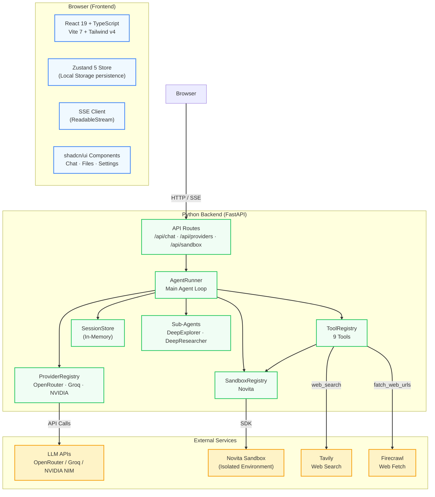
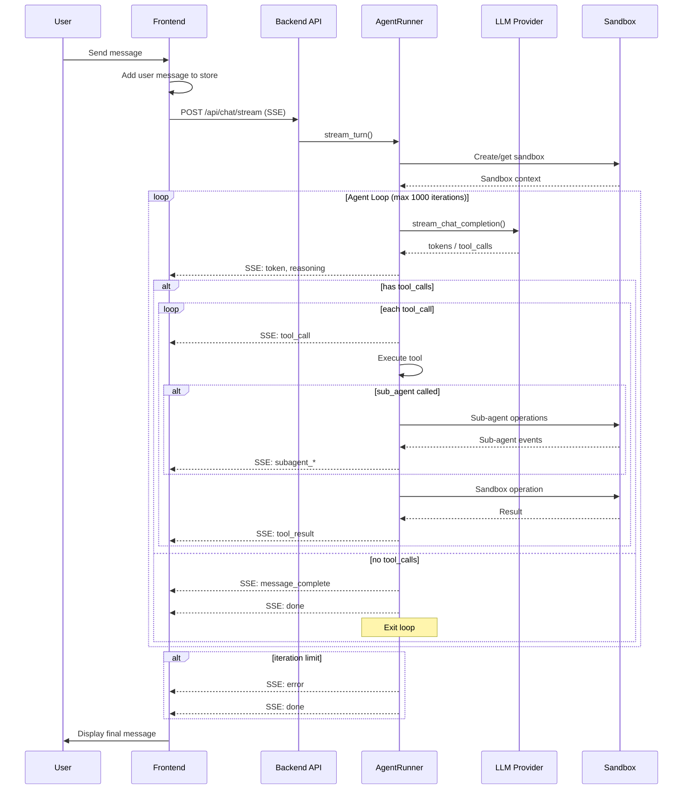

<div align="center">
  <br/>
  <pre style="
    font-family: 'SF Mono', 'Fira Code', 'Cascadia Code', monospace;
    font-size: 13px;
    line-height: 1.5;
    background: #1a1a2e;
    color: #e0e0e0;
    padding: 24px 28px;
    border-radius: 16px;
    display: inline-block;
    text-align: left;
    letter-spacing: 0.3px;
    box-shadow: 0 8px 32px rgba(0,0,0,0.3);
    border: 1px solid #2a2a4a;
  "><span style="color:#ffc700;font-weight:bold;">  ╔══════════════════════════════════════════════╗</span>
<span style="color:#ffc700;font-weight:bold;">  ║</span>  <span style="color:#a855f7;font-weight:bold;">   ██████╗ ██████╗ ██████╗ ██████╗ ██████╗   </span>  <span style="color:#ffc700;font-weight:bold;">║</span>
<span style="color:#ffc700;font-weight:bold;">  ║</span>  <span style="color:#a855f7;font-weight:bold;">  ██╔══██╗██╔══██╗██╔══██╗██╔══██╗██╔══██╗  </span>  <span style="color:#ffc700;font-weight:bold;">║</span>
<span style="color:#ffc700;font-weight:bold;">  ║</span>  <span style="color:#a855f7;font-weight:bold;">  ██████╔╝██████╔╝██████╔╝██████╔╝██████╔╝  </span>  <span style="color:#ffc700;font-weight:bold;">║</span>
<span style="color:#ffc700;font-weight:bold;">  ║</span>  <span style="color:#a855f7;font-weight:bold;">  ██╔═══╝ ██╔══██╗██╔══██╗██╔══██╗██╔══██╗  </span>  <span style="color:#ffc700;font-weight:bold;">║</span>
<span style="color:#ffc700;font-weight:bold;">  ║</span>  <span style="color:#a855f7;font-weight:bold;">  ██║     ██║  ██║██║  ██║██║  ██║██║  ██║  </span>  <span style="color:#ffc700;font-weight:bold;">║</span>
<span style="color:#ffc700;font-weight:bold;">  ║</span>  <span style="color:#a855f7;font-weight:bold;">  ╚═╝     ╚═╝  ╚═╝╚═╝  ╚═╝╚═╝  ╚═╝╚═╝  ╚═╝  </span>  <span style="color:#ffc700;font-weight:bold;">║</span>
<span style="color:#ffc700;font-weight:bold;">  ╚══════════════════════════════════════════════╝</span>

  <span style="color:#22c55e;">▸</span> <span style="color:#a1a1aa;">Production-grade autonomous AI agent workspace</span>
  <span style="color:#22c55e;">▸</span> <span style="color:#a1a1aa;">Sandboxed file operations · Shell execution · Web search</span>
  <span style="color:#22c55e;">▸</span> <span style="color:#a1a1aa;">Powered by</span> <span style="color:#f97316;">OpenRouter</span><span style="color:#a1a1aa;"> / </span><span style="color:#f97316;">Groq</span><span style="color:#a1a1aa;"> / </span><span style="color:#f97316;">NVIDIA NIM</span>
  <span style="color:#22c55e;">▸</span> <span style="color:#a1a1aa;">Runtime:</span> <span style="color:#3b82f6;">Python 3.14</span> <span style="color:#a1a1aa;">+</span> <span style="color:#38bdf8;">FastAPI</span> <span style="color:#a1a1aa;">·</span> <span style="color:#3b82f6;">React 19</span> <span style="color:#a1a1aa;">+</span> <span style="color:#38bdf8;">Vite 7</span>
  <span style="color:#22c55e;">▸</span> <span style="color:#a1a1aa;">Sandbox:</span> <span style="color:#38bdf8;">Novita</span>
</pre>
  <br/>
</div>

<!-- BADGES -->
<p align="center">
  
  
  
  
  
  
  
  
</p>

---

## Overview

**OpenCurro** (also known as **Novita Agent Studio**) is a full-stack web application that runs an autonomous AI coding agent inside an **isolated Novita sandbox**. The agent can read, write, and edit files, execute shell commands, search the web, fetch URLs, and delegate complex tasks to specialized sub-agents — all through a polished real-time chat interface.

<p align="center">
  <strong>🚀 Try it:</strong> Configure API keys → Select a model → Start building.
</p>

---

## ✨ Features

<table>
<tr>
<td width="50%">

### 🧠 Agent Capabilities
- **Autonomous task execution** with tool-calling loop
- **9 built-in tools** — files, shell, web, sub-agents
- **Streaming SSE** — real-time token, reasoning, and tool output
- **Structured error handling** — graceful recovery from failures
- **Background command execution** — run long processes without blocking

</td>
<td width="50%">

### 🖥️ Frontend Experience
- **Chat interface** with real-time token streaming
- **Collapsible tool outputs** — terminal, file ops, web search
- **Sandbox file explorer** with inline editor/viewer
- **Sub-agent activity modal** — see what agents do in real time
- **Mobile-responsive** layout with tab navigation
- **Persistent** chat history and settings via Local Storage

</td>
</tr>
<tr>
<td width="50%">

### 🔧 Backend Architecture
- **FastAPI** with SSE streaming endpoints
- **Registry pattern** — providers, sandbox adapters, tools, sub-agents
- **Protocol-based abstractions** — `LLMProvider`, `SandboxAdapter`
- **In-memory session store** — no database required
- **Dependency injection** via factory router functions

</td>
<td width="50%">

### 🔌 Extensible Design
- **3 LLM providers**: OpenRouter, Groq, NVIDIA NIM
- **Novita sandbox** with file/command operations
- **2 sub-agents**: DeepExplorer (code), DeepResearcher (web)
- **Easy to extend**: add providers, tools, sandbox adapters
- **Custom templates** — optional sandbox template IDs

</td>
</tr>
</table>

---

## 🏗️ Architecture



### Data Flow



---

## 🧰 Tools

The agent has access to **9 tools** for autonomous work:

| Tool | Purpose |
|---|---|
| `file_read` | Read file content from the sandbox |
| `file_write` | Create or overwrite files in the sandbox |
| `str_replace` | Exact string replacement (precise edits) |
| `list_files` | List directory contents |
| `shall_tool` | Execute shell commands (blocking or background) |
| `shell_view` | View output of background commands |
| `web_search` | Web search via Tavily API |
| `fatch_web_urls` | Fetch web page content via Firecrawl |
| `call_sub_agent` | Delegate task to a specialized sub-agent |

---

## 🤖 Sub-Agents

| Agent | Purpose | Allowed Tools |
|---|---|---|
| **DeepExplorer** | Read-only code exploration | `list_files`, `file_read` |
| **DeepResearcher** | Web research with file output | `web_search`, `fatch_web_urls`, `file_write`, `list_files`, `shall_tool` |

Sub-agents run in their own mini agent loops with restricted tool sets, communicating results back via `asyncio.Queue`.

---

## 🚀 Getting Started

### Prerequisites

- Python 3.14+
- Node.js 20+
- API keys for: LLM provider (OpenRouter/Groq/NVIDIA), Novita sandbox, and optionally Tavily/Firecrawl

### Development Setup

```bash
# 1. Clone the repository
git clone https://github.com/your-org/opencurro.git
cd opencurro

# 2. Start backend
cd backend
pip install -r requirements.txt
uvicorn src.main:app --reload --port 8000

# 3. Start frontend (in another terminal)
cd frontend
npm install
npm run dev
```

The frontend dev server proxies `/api` to `localhost:8000` via Vite.

### Production (Docker)

```bash
docker build -t opencurro .
docker run -p 8000:8000 opencurro
```

---

## 📁 Project Structure

```
opencurro/
├── backend/                          # Python FastAPI backend
│   ├── src/
│   │   ├── main.py                   # App entry point
│   │   ├── core/config.py            # pydantic-settings
│   │   ├── schemas/                  # Pydantic models
│   │   ├── api/                      # Router factories
│   │   ├── services/                 # Session store
│   │   ├── agents/
│   │   │   ├── agent.py              # AgentRunner loop
│   │   │   ├── providers/            # LLM providers (OpenAI-compatible)
│   │   │   ├── sandbox/              # Sandbox adapter (Novita)
│   │   │   ├── tools/                # 9 tool implementations
│   │   │   ├── subagents/            # DeepExplorer + DeepResearcher
│   │   │   └── systemprompts/        # System prompt
│   │   └── tests/                    # pytest
│   └── requirements.txt
├── frontend/                         # React + Vite + TypeScript
│   ├── src/
│   │   ├── App.tsx                   # Root layout
│   │   ├── components/chat/          # Chat UI
│   │   ├── components/files/         # File explorer
│   │   ├── components/settings/      # Settings modal
│   │   ├── store/                    # Zustand stores (persisted)
│   │   ├── hooks/                    # useAgentChat, useProviders
│   │   ├── lib/                      # API client, env, utils
│   │   └── types/                    # TypeScript interfaces
│   └── package.json
├── Dockerfile                        # Multi-stage production build
├── Dockerfile.base                   # Pre-built base image
├── start.sh / stop.sh                # Dev scripts
└── specs/                            # Design specifications
```

---

## 🔌 API Endpoints

| Method | Endpoint | Description |
|---|---|---|
| GET | `/health` | Health check |
| GET | `/api/providers` | List supported LLM providers |
| POST | `/api/providers/models` | Fetch models for a provider |
| POST | `/api/chat/session` | Create or hydrate a chat session |
| POST | `/api/chat/stream` | Send message and stream SSE response |
| GET | `/api/sandbox/files` | List sandbox file tree |
| GET | `/api/sandbox/file-content` | Read sandbox file content |
| POST | `/api/sandbox/file-content` | Write sandbox file content |

### SSE Event Protocol

| Event | Direction | Description |
|---|---|---|
| `status` | Backend → Frontend | Lifecycle status updates |
| `iteration` | Backend → Frontend | Current iteration / limit |
| `sandbox` | Backend → Frontend | Sandbox created info |
| `token` | Backend → Frontend | LLM response token |
| `reasoning` | Backend → Frontend | LLM reasoning token |
| `tool_call` | Backend → Frontend | Tool being invoked |
| `tool_result` | Backend → Frontend | Tool execution result |
| `subagent_*` | Backend → Frontend | Sub-agent lifecycle events |
| `message_complete` | Backend → Frontend | Final assembled response |
| `error` | Backend → Frontend | Error occurred |
| `done` | Backend → Frontend | Turn complete |

---

## 🧪 Testing

```bash
cd backend
pytest src/tests/ -v
```

---

## 🔧 Configuration

Configuration is handled via environment variables (see `backend/src/core/config.py`):

| Variable | Default | Description |
|---|---|---|
| `APP_NAME` | `Novita Agent Studio API` | Application name |
| `API_PREFIX` | `/api` | API route prefix |
| `CORS_ORIGINS` | `["*"]` | Allowed CORS origins |
| `MAX_ITERATION_LIMIT` | `1000` | Max agent loop iterations |
| `SANDBOX_ROOT_PATH` | `/home/user` | Sandbox filesystem root |
| `DEFAULT_SANDBOX_TIMEOUT` | `3600` | Sandbox idle timeout (seconds) |
| `TAVILY_API_KEY` | `""` | Tavily web search key |
| `FIRECRAWL_API_KEY` | `""` | Firecrawl web fetch key |

---

## 🧱 Key Design Decisions

- **No database** — All persistence is browser Local Storage via Zustand `persist` middleware; backend sessions are in-memory
- **Registry pattern** — Providers, sandbox adapters, tools, and sub-agents all self-register
- **Protocol-based abstraction** — `LLMProvider` and `SandboxAdapter` are Python Protocols for strong typing without coupling
- **SSE streaming** — Agent loop yields structured events via async generator; frontend parses with `ReadableStream`
- **DI via factory functions** — API routers receive dependencies explicitly, wired in `main.py`
- **Structured error handling** — Tools return `ToolExecutionResult(ok=True/False)` instead of raising exceptions
- **Path safety** — All sandbox paths normalized and validated under `/home/user/`

---

## 🧩 Tech Stack

### Backend
| Technology | Purpose |
|---|---|
| **Python 3.14** | Runtime |
| **FastAPI** | Web framework (REST + SSE) |
| **Uvicorn** | ASGI server |
| **Pydantic / pydantic-settings** | Schema validation |
| **httpx** | Async HTTP client |
| **novita-sandbox** | Sandbox Python SDK |
| **tavily-python** | Web search API |
| **firecrawl-py** | Web fetch API |
| **pytest / pytest-asyncio** | Testing |

### Frontend
| Technology | Purpose |
|---|---|
| **React 19** | UI framework |
| **TypeScript 5.8** | Language |
| **Vite 7** | Build tool |
| **Zustand 5** | State management (with persistence) |
| **Tailwind CSS v4** | Utility-first CSS |
| **shadcn/ui (New York)** | Component system |
| **lucide-react** | Icons |
| **class-variance-authority** | Component variants |

---

## 📜 License

MIT

---

<p align="center">
  <sub>Built with ❤️ by the OpenCurro team</sub>
</p>
