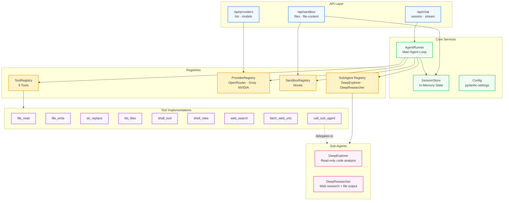
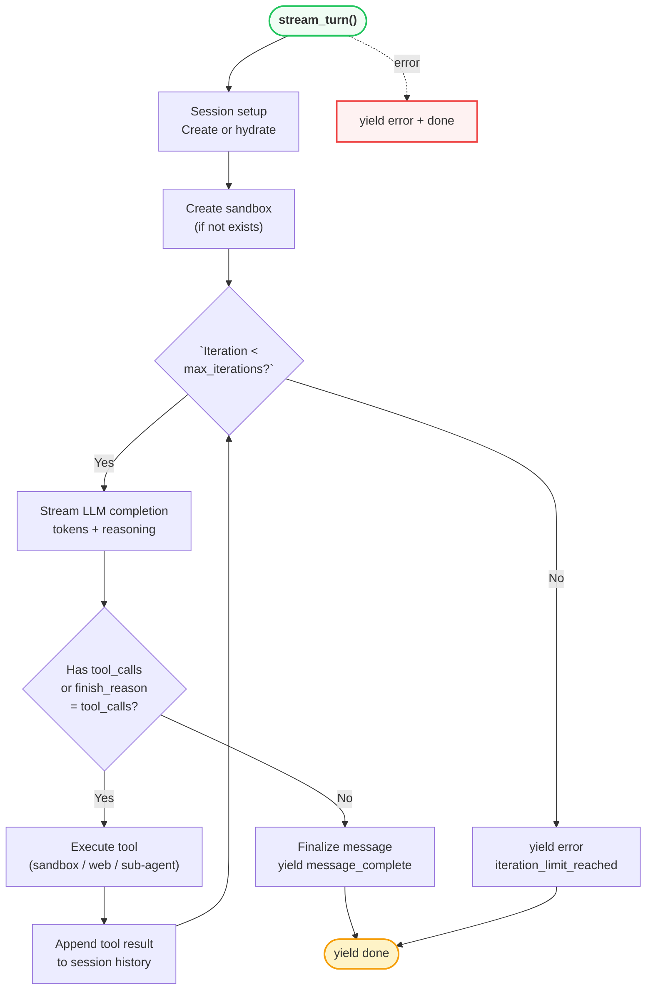
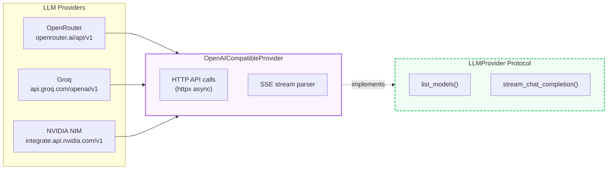
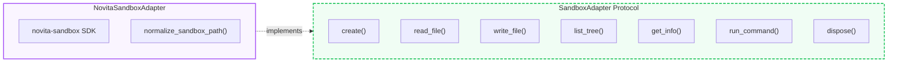
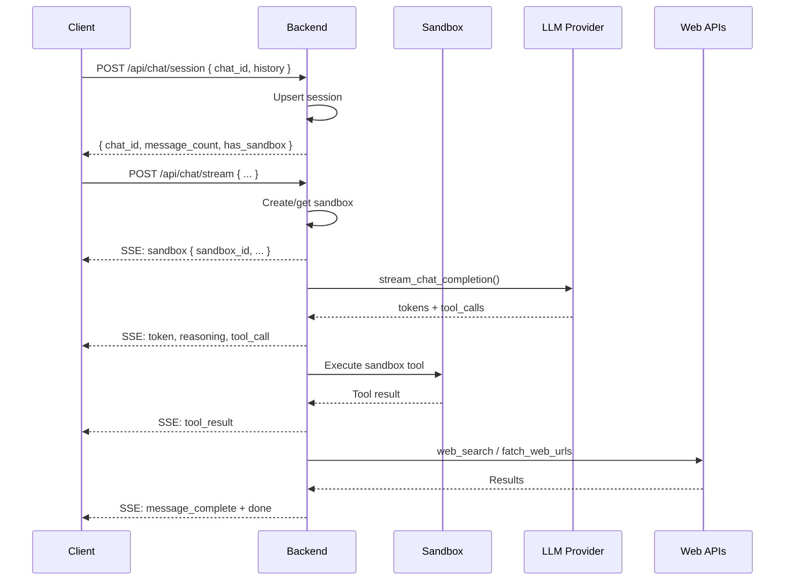

<div align="center">
  <pre style="
    font-family: 'SF Mono', 'Fira Code', 'Cascadia Code', monospace;
    font-size: 13px;
    line-height: 1.5;
    background: #0d1117;
    color: #e0e0e0;
    padding: 20px 24px;
    border-radius: 14px;
    display: inline-block;
    text-align: left;
    box-shadow: 0 8px 32px rgba(0,0,0,0.3);
    border: 1px solid #21262d;
  "><span style="color:#ffc700;">  ┌──────────────────────────────────────────────┐</span>
<span style="color:#ffc700;">  │</span>  <span style="color:#22c55e;">▌</span><span style="color:#3b82f6;">╺━━━━━━━━━━━━━━━━━━━━━━━━━━━━━━━━━━━━━━━━</span><span style="color:#22c55e;">▐</span>  <span style="color:#ffc700;">│</span>
<span style="color:#ffc700;">  │</span>  <span style="color:#22c55e;">▌</span>  <span style="color:#38bdf8;font-weight:bold;">  OpenCurro Backend</span>              <span style="color:#22c55e;">▐</span>  <span style="color:#ffc700;">│</span>
<span style="color:#ffc700;">  │</span>  <span style="color:#22c55e;">▌</span>  <span style="color:#a1a1aa;">  Python 3.14 · FastAPI · SSE</span>     <span style="color:#22c55e;">▐</span>  <span style="color:#ffc700;">│</span>
<span style="color:#ffc700;">  │</span>  <span style="color:#22c55e;">▌</span><span style="color:#3b82f6;">╺━━━━━━━━━━━━━━━━━━━━━━━━━━━━━━━━━━━━━━━━</span><span style="color:#22c55e;">▐</span>  <span style="color:#ffc700;">│</span>
<span style="color:#ffc700;">  └──────────────────────────────────────────────┘</span>

  <span style="color:#22c55e;">▸</span> <span style="color:#a1a1aa;">Runtime:</span> <span style="color:#f97316;">uvicorn src.main:app</span>
  <span style="color:#22c55e;">▸</span> <span style="color:#a1a1aa;">Port:</span> <span style="color:#f97316;">8000</span>
</pre>
</div>

---

## Architecture



---

## Project Structure

```
backend/
├── src/
│   ├── main.py                        # FastAPI entry point, DI wiring, CORS
│   ├── core/
│   │   └── config.py                  # Settings via pydantic-settings
│   ├── schemas/
│   │   ├── chat.py                    # ChatMessage, ChatStreamRequest, SSEEvent
│   │   ├── providers.py               # ProviderType enum, ProviderMetadata, ProviderModel
│   │   └── sandbox.py                 # SandboxSettings, FileTreeNode, ToolExecutionResult
│   ├── api/
│   │   ├── chat.py                    # POST /session, POST /stream (SSE)
│   │   ├── providers.py               # GET /, POST /models
│   │   └── sandbox.py                 # GET /files, GET|POST /file-content
│   ├── services/
│   │   └── session_store.py           # In-memory ChatSessionState storage
│   ├── agents/
│   │   ├── agent.py                   # AgentRunner — main agent loop with SSE
│   │   ├── providers/
│   │   │   ├── base.py                # LLMProvider protocol + ProviderStreamDelta
│   │   │   ├── openai_compatible.py   # OpenAI-compatible implementation
│   │   │   └── registry.py            # ProviderRegistry (3 providers)
│   │   ├── sandbox/
│   │   │   ├── base.py                # SandboxAdapter protocol + SandboxContext
│   │   │   ├── novita.py              # Novita sandbox implementation
│   │   │   └── registry.py            # SandboxRegistry
│   │   ├── tools/
│   │   │   ├── registry.py            # ToolRegistry — schema + handler registration
│   │   │   ├── file_read.py           # Read file from sandbox
│   │   │   ├── file_write.py          # Create/overwrite files
│   │   │   ├── str_replace.py         # Exact string replacement
│   │   │   ├── list_files.py          # List directory contents
│   │   │   ├── shall_tool.py          # Shell command execution
│   │   │   ├── shell_view.py          # Background command output viewer
│   │   │   ├── web_search_tool.py     # Web search via Tavily
│   │   │   ├── fatch_web_urls.py      # Web page fetch via Firecrawl
│   │   │   └── call_sub_agent.py      # Delegate to sub-agent
│   │   ├── subagents/
│   │   │   ├── __init__.py            # Sub-agent registry
│   │   │   ├── deepexplorer/          # Read-only code exploration agent
│   │   │   └── deepresearcher/        # Web research + file output agent
│   │   └── systemprompts/
│   │       └── systemprompt.py        # Main agent system prompt
│   └── tests/
│       ├── test_paths.py              # Sandbox path validation tests
│       └── test_tools.py              # Tool execution unit tests
├── requirements.txt                   # Python dependencies
└── logs/
    └── backend.log                    # Application logs
```

---

## Agent Loop



---

## Schemas

### `ChatStreamRequest`

| Field | Type | Description |
|---|---|---|
| `chat_id` | `string` | Unique chat session ID |
| `user_message` | `string` | User message content |
| `history` | `ChatMessage[]` | Previous conversation history |
| `provider` | `ProviderType` | LLM provider (`openrouter`, `groq`, `nvidia`) |
| `model` | `string` | Model identifier |
| `api_key` | `string` | Provider API key |
| `base_url` | `string?` | Custom base URL |
| `sandbox` | `SandboxSettings` | Sandbox configuration |
| `max_iterations` | `int` | Max agent loop iterations (default 1000) |
| `tavily_api_key` | `string?` | Tavily web search key |
| `firecrawl_api_key` | `string?` | Firecrawl web fetch key |

### `SandboxSettings`

| Field | Type | Description |
|---|---|---|
| `api_key` | `string` | Novita API key |
| `template_id` | `string?` | Optional sandbox template ID |
| `provider` | `"novita"` | Sandbox provider |
| `timeout_seconds` | `int` | Sandbox timeout (default 3600) |

### `ToolExecutionResult`

| Field | Type | Description |
|---|---|---|
| `ok` | `bool` | Whether execution succeeded |
| `data` | `any?` | Result data (if successful) |
| `error` | `dict?` | Error info (if failed) |

---

## SSE Event Types

All streaming responses use Server-Sent Events with the following format:

```
event: <event_type>
data: <json_payload>
```

| Event | Payload | Description |
|---|---|---|
| `status` | `{ state, label }` | Lifecycle update |
| `iteration` | `{ current, limit }` | Agent loop progress |
| `sandbox` | `{ sandbox_id, provider, root_path }` | Sandbox created |
| `token` | `{ value }` | LLM response token |
| `reasoning` | `{ value }` | LLM reasoning token |
| `tool_call` | `{ name, file_path?, command?, ... }` | Tool being invoked |
| `tool_result` | `{ name, file_path?, ok, result }` | Tool execution result |
| `subagent_start` | `{ session, agent }` | Sub-agent started |
| `subagent_token` | `{ session, value }` | Sub-agent token |
| `subagent_tool_call` | `{ session, name, ... }` | Sub-agent tool call |
| `subagent_tool_result` | `{ session, name, ok, result }` | Sub-agent tool result |
| `subagent_complete` | `{ session }` | Sub-agent finished |
| `subagent_error` | `{ session, message }` | Sub-agent error |
| `message_complete` | `{ content, iteration_count, reasoning? }` | Final response |
| `error` | `{ message, code }` | Error occurred |
| `done` | `{ ok }` | Turn complete |

---

## Tool Implementations

All tools follow the same pattern — they export a `TOOL_SCHEMA` (JSON schema for the LLM) and an `execute_*` handler function:

| File | Tool Name | Schema Key | Handler |
|---|---|---|---|
| `tools/file_read.py` | `file_read` | `FILE_READ_TOOL_SCHEMA` | `execute_file_read` |
| `tools/file_write.py` | `file_write` | `FILE_WRITE_TOOL_SCHEMA` | `execute_file_write` |
| `tools/str_replace.py` | `str_replace` | `STR_REPLACE_TOOL_SCHEMA` | `execute_str_replace` |
| `tools/list_files.py` | `list_files` | `LIST_FILES_TOOL_SCHEMA` | `execute_list_files` |
| `tools/shall_tool.py` | `shall_tool` | `SHALL_TOOL_SCHEMA` | `execute_shall_tool` |
| `tools/shell_view.py` | `shell_view` | `SHELL_VIEW_TOOL_SCHEMA` | `execute_shell_view` |
| `tools/web_search_tool.py` | `web_search` | `WEB_SEARCH_TOOL_SCHEMA` | `execute_web_search` |
| `tools/fatch_web_urls.py` | `fatch_web_urls` | `FETCH_WEB_URLS_TOOL_SCHEMA` | `execute_fatch_web_urls` |
| `tools/call_sub_agent.py` | `call_sub_agent` | `CALL_SUB_AGENT_TOOL_SCHEMA` | `execute_call_sub_agent` |

---

## Sub-Agents

### DeepExplorer (`subagents/deepexplorer/`)
- **Purpose**: Read-only code exploration and analysis
- **Allowed tools**: `list_files`, `file_read`
- **Use case**: Understanding code structure, reading files, answering questions about code

### DeepResearcher (`subagents/deepresearcher/`)
- **Purpose**: Web research with file output capabilities
- **Allowed tools**: `web_search`, `fatch_web_urls`, `file_write`, `list_files`, `shall_tool`
- **Use case**: Researching topics and writing results to files

---

## Provider Abstraction



---

## Sandbox Abstraction



---

## Testing

```bash
# Run all tests
pytest src/tests/ -v

# Run specific test file
pytest src/tests/test_tools.py -v
pytest src/tests/test_paths.py -v
```

---

## Dependencies

```
fastapi          Web framework
uvicorn          ASGI server
python-dotenv    Environment management
pydantic         Schema validation
pydantic-settings  Settings management
httpx            Async HTTP client
novita-sandbox   Novita sandbox SDK
tavily-python    Web search API
firecrawl-py     Web fetch API
pytest           Testing
pytest-asyncio   Async test support
```

---

## Key Design Patterns

### Registry Pattern
All extensible components implement a registry:

```python
# provider_registry.py
class ProviderRegistry:
    _providers: dict[ProviderType, LLMProvider]

# tool_registry.py
class ToolRegistry:
    _schemas: list[dict]
    _handlers: dict[str, callable]

# subagents/__init__.py
SUBAGENT_REGISTRY: dict[str, dict]
```

### Protocol-based Abstraction
Strong typing without coupling:

```python
class LLMProvider(Protocol):
    async def stream_chat_completion(...) -> AsyncGenerator[ProviderStreamDelta, None]: ...

class SandboxAdapter(Protocol):
    async def read_file(self, context: SandboxContext, file_path: str) -> str: ...
```

### Path Safety
All sandbox paths are validated:

```python
def normalize_sandbox_path(file_path: str, root_path: str = "/home/user") -> str:
    path = PurePosixPath(file_path)
    if not path.is_absolute():
        raise ValueError("Path must be absolute.")
    if root not in path.parents:
        raise ValueError(f"Path must stay inside {root_path}.")
    return str(path)
```

---

## Configuration

| Environment Variable | Default | Description |
|---|---|---|
| `APP_NAME` | `Novita Agent Studio API` | App display name |
| `API_PREFIX` | `/api` | API URL prefix |
| `CORS_ORIGINS` | `["*"]` | Allowed CORS origins |
| `MAX_ITERATION_LIMIT` | `1000` | Max agent iterations |
| `SANDBOX_ROOT_PATH` | `/home/user` | Sandbox filesystem root |
| `DEFAULT_SANDBOX_TIMEOUT_SECONDS` | `3600` | Sandbox idle timeout |
| `TAVILY_API_KEY` | `""` | Tavily search API key |
| `FIRECRAWL_API_KEY` | `""` | Firecrawl fetch API key |

---

## API Endpoints

### `GET /health`
Health check endpoint.

### `POST /api/chat/session`
Create or hydrate a chat session in the in-memory store.

### `POST /api/chat/stream`
Send a user message and receive an SSE stream of agent activity.

### `GET /api/providers`
List supported LLM providers (OpenRouter, Groq, NVIDIA NIM).

### `POST /api/providers/models`
Fetch available models for a given provider.

### `GET /api/sandbox/files`
Get the sandbox file tree (JSON structure).

### `GET /api/sandbox/file-content`
Read a file from the sandbox.

### `POST /api/sandbox/file-content`
Write a file in the sandbox.


