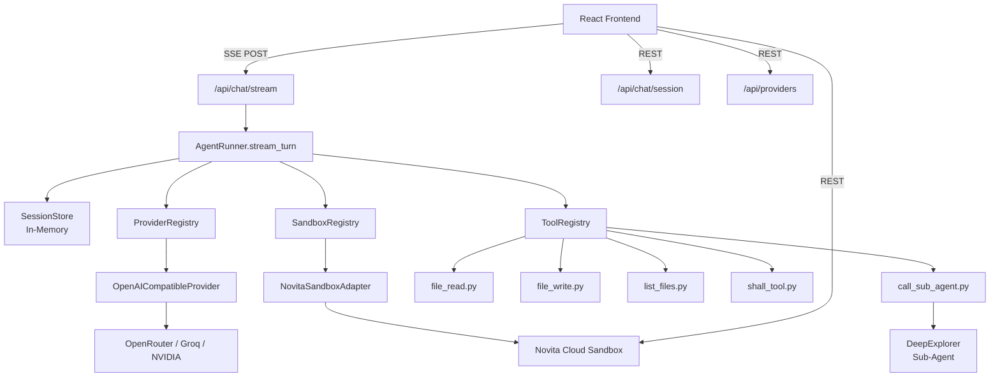
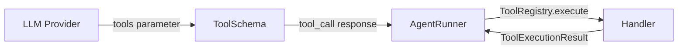

<div align="center">

# ⚙️ OpenCurro Backend


<br />
<br />

<strong>FastAPI backend powering the autonomous AI agent loop, LLM provider abstraction, Novita sandbox integration, and real-time SSE streaming.</strong>

</div>

---

## 📋 Table of Contents

- [Architecture](#-architecture)
- [Project Structure](#-project-structure)
- [Getting Started](#-getting-started)
- [Configuration](#-configuration)
- [API Reference](#-api-reference)
- [Agent Loop](#-agent-loop)
- [Tool System](#-tool-system)
- [Provider System](#-provider-system)
- [Sandbox System](#-sandbox-system)
- [Sub-Agent System](#-sub-agent-system)
- [Testing](#-testing)
- [Error Handling](#-error-handling)

---

## 🏗 Architecture



### Request Flow

```
1. Client sends POST /api/chat/session → SessionStore.upsert_history()
2. Client sends POST /api/chat/stream  → AgentRunner.stream_turn()
3. AgentRunner:
   a. Creates sandbox (if first turn) via SandboxAdapter.create()
   b. Calls LLM provider via ProviderAdapter.stream_chat_completion()
   c. If tool_calls returned:
      - Executes tool via ToolRegistry.execute()
      - Appends tool result to session messages
      - Goes back to step (b)
   d. If text response: yields SSE "token" events
   e. Yields "message_complete" + "done"
```

---

## 📁 Project Structure

```
backend/
├── src/
│   ├── main.py                     # FastAPI app, CORS, router mounting
│   ├── __init__.py
│   │
│   ├── api/                        # HTTP route handlers
│   │   ├── chat.py                 # POST /session, POST /stream
│   │   ├── providers.py            # GET /providers, POST /providers/models
│   │   └── sandbox.py              # GET /files, GET /file-content, POST /file-content
│   │
│   ├── agents/                     # Core agent logic
│   │   ├── agent.py                # AgentRunner — async streaming event loop
│   │   │
│   │   ├── providers/              # LLM provider abstraction
│   │   │   ├── base.py             # LLMProvider protocol, ProviderStreamDelta
│   │   │   ├── openai_compatible.py # OpenAI-compatible chat completions
│   │   │   └── registry.py         # ProviderRegistry (OpenRouter, Groq, NVIDIA)
│   │   │
│   │   ├── sandbox/                # Sandbox provider abstraction
│   │   │   ├── base.py             # SandboxAdapter protocol, SandboxContext, path validation
│   │   │   ├── novita.py           # Novita sandbox implementation (novita-sandbox SDK)
│   │   │   └── registry.py         # SandboxRegistry
│   │   │
│   │   ├── tools/                  # AI-accessible tool definitions
│   │   │   ├── registry.py         # ToolRegistry — schemas + handler mapping
│   │   │   ├── file_read.py        # FILE_READ_TOOL_SCHEMA + execute_file_read
│   │   │   ├── file_write.py       # FILE_WRITE_TOOL_SCHEMA + execute_file_write
│   │   │   ├── list_files.py       # LIST_FILES_TOOL_SCHEMA + execute_list_files
│   │   │   ├── shall_tool.py       # SHALL_TOOL_SCHEMA + execute_shall_tool
│   │   │   └── call_sub_agent.py   # CALL_SUB_AGENT_TOOL_SCHEMA + execute_call_sub_agent
│   │   │
│   │   ├── subagents/              # Specialized sub-agents
│   │   │   ├── __init__.py         # SubAgent registry (register/get)
│   │   │   └── deepexplorer/       # Codebase exploration sub-agent
│   │   │       ├── agent.py        # run_deepexplorer() — read-only loop
│   │   │       └── systemprompt.py # DeepExplorer system prompt
│   │   │
│   │   └── systemprompts/
│   │       └── systemprompt.py     # Main agent system prompt
│   │
│   ├── core/
│   │   └── config.py               # Pydantic Settings class
│   │
│   ├── schemas/                    # Pydantic models (request/response)
│   │   ├── chat.py                 # ChatMessage, ChatStreamRequest, SSEEvent
│   │   ├── providers.py            # ProviderType, ProviderMetadata, ProviderModel
│   │   └── sandbox.py              # SandboxSettings, FileTreeNode, ToolExecutionResult
│   │
│   ├── services/
│   │   └── session_store.py        # In-memory ChatSessionState store
│   │
│   └── tests/                      # Pytest tests
│       ├── test_paths.py           # Path validation tests
│       └── test_tools.py           # Tool execution tests
│
├── requirements.txt                # Python dependencies
├── README.md                       # This file
└── .gitignore
```

---

## 🚀 Getting Started

```bash
cd backend
python -m venv .venv
source .venv/bin/activate   # Windows: .venv\Scripts\activate
pip install -r requirements.txt
uvicorn src.main:app --reload --port 8000
```

Verify: `curl http://localhost:8000/health` → `{"status":"healthy"}`

View interactive API docs: `http://localhost:8000/docs`

---

## ⚙️ Configuration

Configuration is managed via **pydantic-settings** in `src/core/config.py:12`. Values can be set via environment variables, a `.env` file, or defaults:

| Variable | Type | Default | Description |
|----------|------|---------|-------------|
| `APP_NAME` | `str` | `Novita Agent Studio API` | FastAPI application title |
| `API_PREFIX` | `str` | `/api` | Prefix for all API routes |
| `CORS_ORIGINS` | `list[str]` | `["*"]` | Allowed CORS origins |
| `MAX_ITERATION_LIMIT` | `int` | `1000` | Max agent iterations per user message |
| `SANDBOX_ROOT_PATH` | `str` | `/home/user` | Restricted sandbox filesystem root |
| `DEFAULT_SANDBOX_TIMEOUT_SECONDS` | `int` | `3600` | Sandbox timeout (1 hour) |

### Dependencies (`requirements.txt`)

```
fastapi            # Web framework
uvicorn            # ASGI server
python-dotenv      # .env file loading
pydantic           # Data validation
pydantic-settings  # Settings management
pytest             # Test framework
pytest-asyncio     # Async test support
httpx              # Async HTTP client (for LLM API calls)
novita-sandbox     # Novita sandbox SDK
```

---

## 🌐 API Reference

### Health

<details>
<summary><code>GET /health</code></summary>

**Response:**
```json
{ "status": "healthy" }
```
</details>

### Providers

<details>
<summary><code>GET /api/providers</code></summary>

Returns supported LLM providers.

**Response:**
```json
[
  {
    "id": "openrouter",
    "label": "OpenRouter",
    "default_base_url": "https://openrouter.ai/api/v1",
    "supports_tools": true,
    "supports_streaming": true
  },
  {
    "id": "groq",
    "label": "Groq",
    "default_base_url": "https://api.groq.com/openai/v1",
    "supports_tools": true,
    "supports_streaming": true
  },
  {
    "id": "nvidia",
    "label": "NVIDIA NIM",
    "default_base_url": "https://integrate.api.nvidia.com/v1",
    "supports_tools": true,
    "supports_streaming": true
  }
]
```
</details>

<details>
<summary><code>POST /api/providers/models</code></summary>

Fetches available models from a provider.

**Request:**
```json
{
  "provider": "openrouter",
  "api_key": "sk-...",
  "base_url": "https://openrouter.ai/api/v1"
}
```

**Response:**
```json
{
  "provider": "openrouter",
  "models": [
    {
      "id": "anthropic/claude-3.5-sonnet",
      "provider": "openrouter",
      "label": "anthropic/claude-3.5-sonnet",
      "owned_by": "anthropic",
      "supports_tools": true,
      "context_window": 200000
    }
  ]
}
```
</details>

### Chat

<details>
<summary><code>POST /api/chat/session</code></summary>

Creates or rehydrates a backend chat session.

**Request:**
```json
{
  "chat_id": "chat-123",
  "history": [
    { "role": "user", "content": "Hello" }
  ]
}
```

**Response:**
```json
{
  "chat_id": "chat-123",
  "message_count": 1,
  "has_sandbox": false
}
```
</details>

<details>
<summary><code>POST /api/chat/stream</code></summary>

**SSE endpoint** — the core agent interaction. Sends a user message and streams back token-by-token SSE events.

**Request:**
```json
{
  "chat_id": "chat-123",
  "user_message": "Create a React counter component",
  "history": [],
  "provider": "openrouter",
  "model": "anthropic/claude-3.5-sonnet",
  "api_key": "sk-...",
  "sandbox": {
    "api_key": "nv-...",
    "provider": "novita",
    "timeout_seconds": 3600
  },
  "max_iterations": 1000
}
```

**SSE Response Events:**

```
event: status
data: {"state": "creating_sandbox", "label": "Creating sandbox..."}

event: sandbox
data: {"sandbox_id": "sb-xxx", "provider": "novita", "root_path": "/home/user"}

event: status
data: {"state": "thinking", "label": "Thinking..."}

event: iteration
data: {"current": 1, "limit": 1000}

event: token
data: {"value": "Sure"}

event: token
data: {"value": ", I'll create"}

event: tool_call
data: {"name": "file_write", "file_path": "/home/user/project/src/Counter.tsx", "label": "Create: /home/user/project/src/Counter.tsx"}

event: tool_result
data: {"name": "file_write", "file_path": "/home/user/project/src/Counter.tsx", "ok": true, "result": {...}}

event: message_complete
data: {"content": "Sure, I'll create a React counter component...", "iteration_count": 2}

event: done
data: {"ok": true}
```

Full event list:

| Event | Description |
|-------|-------------|
| `status` | Ambient status updates |
| `iteration` | Current iteration count |
| `sandbox` | Sandbox created |
| `token` | Streaming text token |
| `tool_call` | Tool invocation started |
| `tool_result` | Tool execution result |
| `message_complete` | Full response assembled |
| `subagent_start` | Sub-agent session started |
| `subagent_token` | Sub-agent text token |
| `subagent_tool_call` | Sub-agent tool call |
| `subagent_tool_result` | Sub-agent tool result |
| `subagent_complete` | Sub-agent finished |
| `subagent_error` | Sub-agent error |
| `error` | System error |
| `done` | Stream complete |
</details>

### Sandbox

<details>
<summary><code>GET /api/sandbox/files</code></summary>

List sandbox file tree.

**Query Params:** `chat_id`, `path` (default `/home/user`), `depth` (default 4)

**Response:**
```json
{
  "sandbox": { "sandbox_id": "sb-xxx", "provider": "novita", ... },
  "path": "/home/user",
  "tree": [
    {
      "name": "project",
      "path": "/home/user/project",
      "type": "dir",
      "children": [
        { "name": "src", "path": "/home/user/project/src", "type": "dir", "children": [] }
      ]
    }
  ]
}
```
</details>

<details>
<summary><code>GET /api/sandbox/file-content</code></summary>

Read file content from sandbox.

**Query Params:** `chat_id`, `path`

**Response:** `{ "path": "/home/user/file.ts", "content": "..." }`
</details>

<details>
<summary><code>POST /api/sandbox/file-content</code></summary>

Write file content to sandbox.

**Request:**
```json
{
  "chat_id": "chat-123",
  "path": "/home/user/file.ts",
  "content": "console.log('hello');"
}
```

**Response:** `{ "path": "/home/user/file.ts", "ok": true }`
</details>

---

## 🔄 Agent Loop

The agent loop is implemented in `src/agents/agent.py` in the `AgentRunner` class.

### `AgentRunner.stream_turn()` Lifecycle

```
1. Session Setup
   → upsert_history() — append user message to session memory
   → yield "iteration" event

2. Sandbox Provisioning (first turn only)
   → SandboxAdapter.create()
   → yield "sandbox" event with sandbox_id

3. Provider Loop (up to max_iterations)
   a. yield "status" → "thinking"
   b. Provider.stream_chat_completion(messages + tools)
   c. For each delta:
      - text → yield "token" event
      - tool_calls → accumulate
   d. If tool_call requested:
      - yield "tool_call" event
      - ToolRegistry.execute(tool_name, arguments, sandbox_adapter, sandbox_context)
      - While tool runs: forward subagent events from queue
      - yield "tool_result" event
      - Append tool result to session messages
      - Continue loop (go back to step a)
   e. If text response:
      - Append assistant message to session messages
      - yield "message_complete" event
      - yield "done" event → return

4. Iteration limit reached
   → yield "error" → "done"
```

### Key Implementation Details

- **Async generator** — the entire turn is a single `AsyncGenerator[str, None]` yielding SSE-formatted strings
- **Sub-agent events** — forwarded via an `asyncio.Queue` that the tool task and event loop coordinate over
- **Tool call merging** — `_merge_tool_calls()` accumulates streaming tool call deltas into complete tool call objects
- **Parallel tool calls disabled** — `parallel_tool_calls: false` ensures predictable serial execution

---

## 🛠 Tool System

Tools are defined in `src/agents/tools/` with a schema + handler pattern.

### Architecture



### Available Tools

| Tool | File | Description |
|------|------|-------------|
| `file_write` | `tools/file_write.py` | Create or overwrite files in sandbox |
| `file_read` | `tools/file_read.py` | Read file content (with line numbers) |
| `shall_tool` | `tools/shall_tool.py` | Execute shell commands in sandbox |
| `list_files` | `tools/list_files.py` | List directory contents |
| `call_sub_agent` | `tools/call_sub_agent.py` | Invoke a specialized sub-agent |

### Tool Schema Format

Each tool exports a `TOOL_SCHEMA` constant (OpenAI-compatible JSON schema) and an `execute_*` async handler:

```python
# Schema
SHALL_TOOL_SCHEMA = {
    "type": "function",
    "function": {
        "name": "shall_tool",
        "description": "Execute shell commands in the sandbox...",
        "parameters": {
            "type": "object",
            "properties": {
                "session_name": {"type": "string", ...},
                "command": {"type": "string", ...},
                "wait_for_output": {"type": "boolean", ...},
            },
            "required": ["session_name", "command"]
        }
    }
}

# Handler — must return ToolExecutionResult
async def execute_shall_tool(*, sandbox_adapter, sandbox_context, arguments, **kwargs):
    ...
    return ToolExecutionResult(ok=True, data=result)
```

### ToolRegistry (`src/agents/tools/registry.py`)

- Maps tool names → schemas and handlers
- `schemas` property returns all tool schemas for LLM provider
- `execute()` handles JSON parsing, dispatch, and error wrapping

### Tool Result Format

```python
class ToolExecutionResult(BaseModel):
    ok: bool
    data: Optional[Any] = None
    error: Optional[dict] = None  # {"code": "...", "message": "..."}
```

---

## 🏪 Provider System

The provider system in `src/agents/providers/` abstracts LLM API interactions.

### ProviderRegistry

Pre-configured with 3 providers at startup (`registry.py:7`):

| Provider | Adapter | Default Base URL |
|----------|---------|-----------------|
| `openrouter` | `OpenAICompatibleProvider` | `https://openrouter.ai/api/v1` |
| `groq` | `OpenAICompatibleProvider` | `https://api.groq.com/openai/v1` |
| `nvidia` | `OpenAICompatibleProvider` | `https://integrate.api.nvidia.com/v1` |

### OpenAICompatibleProvider (`openai_compatible.py`)

- **`list_models(api_key, base_url)`** — `GET /models` → normalized `ProviderModel[]`
- **`stream_chat_completion(api_key, model, messages, tools, base_url)`** — `POST /chat/completions` with `stream: true` → yields `ProviderStreamDelta`
- SSE parsing via `_iter_sse_events()` — buffers chunks, splits on `\n\n`, parses `data:` lines
- Special headers: adds `X-Title: Novita Agent Studio` for OpenRouter

### LLMProvider Protocol (`base.py`)

```python
class LLMProvider(Protocol):
    metadata: ProviderMetadata

    async def list_models(self, api_key: str, base_url: Optional[str] = None) -> list[ProviderModel]: ...

    async def stream_chat_completion(self, *, api_key, model, messages, tools, base_url=None, temperature=0.2) -> AsyncGenerator[ProviderStreamDelta, None]: ...
```

---

## 🏖 Sandbox System

The sandbox system in `src/agents/sandbox/` provides a clean abstraction over remote sandbox environments.

### SandboxAdapter Protocol (`base.py`)

```python
class SandboxAdapter(Protocol):
    provider_name: str

    async def create(self, settings: SandboxSettings) -> SandboxContext: ...
    async def read_file(self, context: SandboxContext, path: str) -> str: ...
    async def write_file(self, context: SandboxContext, path: str, content: str) -> dict: ...
    async def list_tree(self, context: SandboxContext, path: str, depth: int) -> list[FileTreeNode]: ...
    async def get_info(self, context: SandboxContext, path: str) -> FileInfoModel: ...
    async def ensure_ready(self, context: SandboxContext) -> None: ...
    async def run_command(self, context: SandboxContext, command: str, timeout: int, wait_for_output: bool) -> dict: ...
    async def dispose(self, context: SandboxContext) -> None: ...
```

### NovitaSandboxAdapter (`novita.py`)

Uses the `novita-sandbox` Python SDK:

```
AsyncSandbox.create(api_key, template, timeout, auto_pause=True, metadata, lifecycle)
  → returns SandboxContext with sandbox_id, root_path="/home/user", timeout_seconds
```

Key behaviors:
- **1-hour timeout** with `auto_pause=True` and `on_timeout: "pause"` + `auto_resume: true`
- **Path validation** via `normalize_sandbox_path()` — prevents directory traversal
- **Auto-create parent directories** when writing files (`_ensure_parent_dirs()`)
- **Command execution** with optional background mode (`wait_for_output: false` → returns PID)

### Path Validation (`base.py:normalize_sandbox_path`)

```python
def normalize_sandbox_path(file_path: str, root_path: str = "/home/user") -> str:
    # Must be absolute
    # Must equal root or be inside root
    # Raises ValueError for traversal attempts
```

---

## 🤖 Sub-Agent System

### SubAgent Registry (`subagents/__init__.py`)

```python
SUBAGENT_REGISTRY: dict[str, dict] = {}

def register_subagent(name, *, system_prompt, allowed_tools, run_func): ...
def get_subagent(name) -> dict | None: ...
```

### DeepExplorer Sub-Agent (`subagents/deepexplorer/`)

A read-only codebase exploration agent:

- **Tools**: `list_files`, `file_read` only (no write or shell access)
- **Loop**: similar to main agent — calls LLM with tools, executes, continues
- **Events**: forwards `subagent_token`, `subagent_tool_call`, `subagent_tool_result`, `subagent_complete`, `subagent_error`
- **System Prompt**: instructs it to explore methodically, trace imports, report line numbers

### Registration

```python
register_subagent(
    name="deepexplorer",
    system_prompt=DEEP_EXPLORER_SYSTEM_PROMPT,
    allowed_tools=DEEP_EXPLORER_TOOLS,
    run_func=run_deepexplorer,
)
```

The `import` in `agent.py:37` triggers automatic registration when `agent.py` is loaded:

```python
import src.agents.subagents.deepexplorer.agent  # triggers registration
```

---

## 💾 Session Store

The `SessionStore` (`src/services/session_store.py`) holds in-memory `ChatSessionState` objects:

```python
@dataclass
class ChatSessionState:
    chat_id: str
    messages: list[dict]           # Full conversation history
    sandbox_context: Optional[SandboxContext]  # Active sandbox (persists across turns)
    created_at: datetime
    updated_at: datetime
```

Methods: `get_or_create()`, `upsert_history()`, `get()`, `delete()`

Note: Sessions are lost on server restart (in-memory only). The frontend persists chat summaries in Local Storage.

---

## 🧪 Testing

```bash
cd backend
pytest -v
```

### Test Files

| File | Description |
|------|-------------|
| `tests/test_paths.py` | Validates `normalize_sandbox_path()` — absolute paths, traversal blocking |
| `tests/test_tools.py` | Validates tool execution result shapes — success, file-not-found, error formatting |

### Writing Tests

Uses `pytest` + `pytest-asyncio` for async test support:

```python
@pytest.mark.asyncio
async def test_tool_read_success():
    result = await execute_file_read(
        sandbox_adapter=MockSandboxAdapter(),
        sandbox_context=MockSandboxContext(),
        arguments={"file_path": "/home/user/test.txt"},
    )
    assert result.ok is True
```

---

## ❗ Error Handling

The system has layered error handling:

1. **Provider API errors** — caught in `stream_turn()`, emitted as SSE error events
2. **Tool execution errors** — wrapped in `ToolExecutionResult(ok=False, error={...})`, appended to session memory so the LLM can recover
3. **Sandbox errors** — caught during creation and file operations
4. **Iteration limit** — graceful termination with error event
5. **HTTP errors** — FastAPI exception handlers return structured JSON

### Error Response Format

```json
{
  "ok": false,
  "error": {
    "code": "file_read_failed",
    "message": "File not found: /home/user/missing.txt",
    "file_path": "/home/user/missing.txt"
  }
}
```

---

<div align="center">
  <sub>Backend service for OpenCurro — Autonomous AI Agent Studio</sub>
</div>
