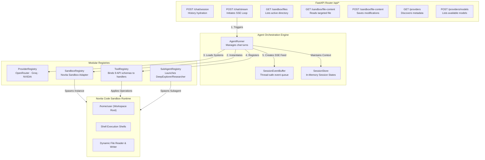
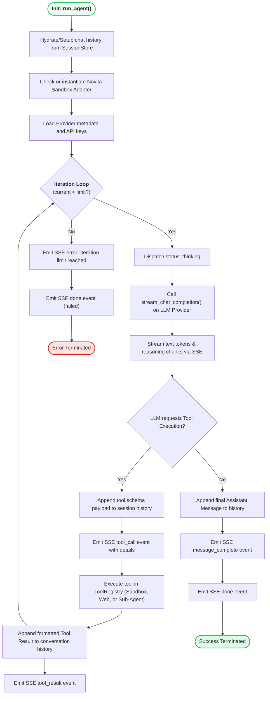

<div align="center">
  <pre style="
    font-family: 'SF Mono', 'Fira Code', 'Cascadia Code', monospace;
    font-size: 13px;
    line-height: 1.5;
    background: #0d1117;
    color: #e0e0e0;
    padding: 20px 24px;
    border-radius: 14px;
    display: inline-block;
    text-align: left;
    box-shadow: 0 8px 32px rgba(0,0,0,0.3);
    border: 1px solid #21262d;
  "><span style="color:#ffc700;">  ┌──────────────────────────────────────────────┐</span>
<span style="color:#ffc700;">  │</span>  <span style="color:#22c55e;">▌</span><span style="color:#3b82f6;">╺━━━━━━━━━━━━━━━━━━━━━━━━━━━━━━━━━━━━━━━━</span><span style="color:#22c55e;">▐</span>  <span style="color:#ffc700;">│</span>
<span style="color:#ffc700;">  │</span>  <span style="color:#22c55e;">▌</span>  <span style="color:#38bdf8;font-weight:bold;">  OpenCurro Backend Engine</span>     <span style="color:#22c55e;">▐</span>  <span style="color:#ffc700;">│</span>
<span style="color:#ffc700;">  │</span>  <span style="color:#22c55e;">▌</span>  <span style="color:#a1a1aa;">  FastAPI · SSE Streaming · Sandboxes</span><span style="color:#22c55e;">▐</span>  <span style="color:#ffc700;">│</span>
<span style="color:#ffc700;">  │</span>  <span style="color:#22c55e;">▌</span><span style="color:#3b82f6;">╺━━━━━━━━━━━━━━━━━━━━━━━━━━━━━━━━━━━━━━━━</span><span style="color:#22c55e;">▐</span>  <span style="color:#ffc700;">│</span>
<span style="color:#ffc700;">  └──────────────────────────────────────────────┘</span>

  <span style="color:#22c55e;">▸</span> <span style="color:#a1a1aa;">Framework:</span> <span style="color:#38bdf8;">FastAPI 0.115+</span>
  <span style="color:#22c55e;">▸</span> <span style="color:#a1a1aa;">Execution Loop:</span> <span style="color:#ec4899;">Autonomous Tool-Calling Thread</span>
  <span style="color:#22c55e;">▸</span> <span style="color:#a1a1aa;">Target sandbox:</span> <span style="color:#22c55e;">Novita SDK</span>
</pre>
</div>

---

## ⚙️ Core Architecture & Execution Flow

The backend of OpenCurro is a stateless, high-concurrency Python API engineered around **FastAPI** and an async **Agent loop** that manages isolated browser/sandbox runtimes.



---

## 🔁 The Autonomous Tool-Calling Agent Loop

When a request arrives at `/api/chat/stream`, the backend spawns a continuous task governed by `AgentRunner.run_agent()`. This loop executes sequentially up to the configured `MAX_ITERATION_LIMIT` (default: 1,000 steps).



---

## 🗂️ Project Layout & Modules

```
backend/
├── src/
│   ├── main.py                        # FastAPI Application Entry point & API wiring
│   ├── core/
│   │   └── config.py                  # Environment parsing via pydantic-settings
│   ├── schemas/                       # Pydantic data schemas
│   │   ├── chat.py                    # Session setup & SSE message protocols
│   │   ├── providers.py               # Metadata representations for LLM models
│   │   └── sandbox.py                 # File node trees, settings & sandbox metrics
│   ├── api/                           # Endpoint controllers
│   │   ├── chat.py                    # Orchestrates session and live SSE streams
│   │   ├── providers.py               # Discovers and queries LLM provider catalogs
│   │   └── sandbox.py                 # Direct APIs for tree browsing and manual edits
│   ├── services/                      # Session management utilities
│   │   ├── event_buffer.py            # Event queue for multi-client stream caching
│   │   └── session_store.py           # In-memory transient session maps
│   ├── agents/                        # Autonomous systems directory
│   │   ├── agent.py                   # Main AgentRunner tool execution engine
│   │   ├── providers/                 # LLM Interfaces
│   │   │   ├── base.py                # Abstract LLMProvider Python Protocol
│   │   │   ├── openai_compatible.py   # General OpenAI adapter (OpenRouter, Groq, NVIDIA)
│   │   │   └── registry.py            # Static list of registered provider definitions
│   │   ├── sandbox/                   # Virtual Sandbox systems
│   │   │   ├── base.py                # Abstract SandboxAdapter Python Protocol
│   │   │   ├── novita.py              # Implementation binding to the novita-sandbox SDK
│   │   │   └── registry.py            # List of active execution engines
│   │   ├── tools/                     # Code tools implementations
│   │   │   ├── registry.py            # Mapping and validation of standard schemas to python executables
│   │   │   ├── file_read.py           # Reads targeted absolute files
│   │   │   ├── file_write.py          # Safely outputs dynamic file content
│   │   │   ├── str_replace.py         # Executes precise matching string edits
│   │   │   ├── list_files.py          # Formats folder directory indexes
│   │   │   ├── shall_tool.py          # Runs background or foreground terminal operations
│   │   │   ├── shell_view.py          # Fetches buffers of active background threads
│   │   │   ├── web_search_tool.py     # Executes web discovery queries using Tavily
│   │   │   ├── fatch_web_urls.py      # Extracts clean markdown representations via Firecrawl
│   │   │   └── call_sub_agent.py      # Sub-Agent runner utility
│   │   └── subagents/                 # Deep sub-agents
│   │       ├── __init__.py            # Main subagent registration and metadata store
│   │       ├── deepexplorer/          # Read-only explorer agent loop
│   │       └── deepresearcher/        # Web and script execution research loop
│   └── tests/                         # Test directory
│       ├── test_paths.py              # Unit tests for sandbox path containment
│       └── test_tools.py              # Mock tests for file operations and shell tools
└── requirements.txt                   # Third-party requirements and SDKs
```

---

## 📡 API Endpoints Spec

### Chat Operations

#### `POST /api/chat/session`
Synchronizes the local user chat state with the backend memory space.
- **Request (JSON)**:
  ```json
  {
    "chat_id": "session-unique-uuid-1234",
    "history": [
      { "role": "user", "content": "How are you?" },
      { "role": "assistant", "content": "I am ready." }
    ]
  }
  ```
- **Response**:
  ```json
  {
    "chat_id": "session-unique-uuid-1234",
    "message_count": 2,
    "has_sandbox": false
  }
  ```

#### `POST /api/chat/stream`
Dispatches the user's latest message, boots or binds to the sandbox, starts the AgentRunner loop, and yields a real-time Server-Sent Events stream.
- **Request (JSON)**: Refer to `ChatStreamRequest` in `src/schemas/chat.py`.
- **Response**: `text/event-stream` format.

---

### Sandbox Management

#### `GET /api/sandbox/files`
Traverses the sandboxed files starting at the target root.
- **Query Params**:
  - `chat_id`: Unique identifier
  - `path`: Absolute directory location (e.g., `/home/user`)
  - `depth`: Depth ceiling (1 to 8, defaults to 4)
- **Response**: `SandboxFilesResponse` model displaying the file tree structure.

#### `GET /api/sandbox/file-content`
Reads file contents directly.
- **Query Params**: `chat_id`, `path`
- **Response**:
  ```json
  {
    "path": "/home/user/project/main.py",
    "content": "print('hello world!')"
  }
  ```

#### `POST /api/sandbox/file-content`
Directly writes file contents. Useful for manual edits by the user in the UI panel.
- **Request (JSON)**:
  ```json
  {
    "chat_id": "session-unique-uuid-1234",
    "path": "/home/user/project/main.py",
    "content": "print('updated!')"
  }
  ```
- **Response**:
  ```json
  {
    "path": "/home/user/project/main.py",
    "ok": true
  }
  ```

---

## 📡 SSE Stream Event Protocol

Every event payload streamed via Server-Sent Events contains standard JSON objects. The following table describes the payload definitions:

| Event Type | Field Definitions | When is it emitted? |
|---|---|---|
| `status` | `{"state": "thinking" \| "executing" \| ..., "label": "Label text"}` | Updates the user on loop execution state. |
| `iteration`| `{"current": 1, "limit": 1000}` | Dispatched at the start of every model turn. |
| `sandbox` | `{"sandbox_id": "sb_123", "provider": "novita", "root_path": "/home/user"}`| Emitted when a new sandbox environment is provisioned. |
| `token` | `{"value": "text_segment"}` | Immediate output segment from the LLM response. |
| `reasoning`| `{"value": "thinking_segment"}` | Output segment containing raw reasoning chains. |
| `tool_call`| `{"name": "shall_tool", "command": "npm test", "label": "Terminal: npm test"}`| Fired immediately prior to initiating a tool execution handler. |
| `tool_result`| `{"name": "shall_tool", "ok": true, "result": {...}}` | Returns the raw results or execution errors from a tool. |
| `subagent_start` | `{"session": "sub_id", "agent": "deepresearcher"}` | Fired when the agent spawns an active sub-agent loop. |
| `subagent_token` | `{"session": "sub_id", "value": "text_token"}` | Raw token from the running sub-agent response thread. |
| `subagent_complete` | `{"session": "sub_id"}` | Emitted when a sub-agent exits successfully. |
| `message_complete` | `{"content": "Full text", "iteration_count": 3}` | Aggregated response summarizing the final answer. |
| `error` | `{"message": "Error details", "code": "code_slug"}` | Emitted on catastrophic loop errors. |
| `done` | `{"ok": true}` | Terminating marker of the stream. |

---

## 🔒 Security & Path Validation Safeguards

To prevent agents from executing commands or writing files in insecure directory paths within the sandbox, the adapter applies strict path validation.

```python
# src/agents/sandbox/base.py

def normalize_sandbox_path(file_path: str, root_path: str = "/home/user") -> str:
    root = PurePosixPath(root_path)
    path = PurePosixPath(file_path)

    # Path must be absolute and contain root
    if not path.is_absolute():
        raise ValueError("Path must be absolute.")

    if root not in path.parents and path != root:
        raise ValueError(f"Path must stay inside sandbox root directory: {root_path}")

    return str(path)
```

The validation layer forces:
1. **Absolute Path Declarations**: Any path parameter passed to file read or edit tools must start with `/`.
2. **Strict Root Containment**: Path queries are checked against parent chains to prevent directory traversal exploits (e.g., `/home/user/../../etc/passwd`).

---

## 🧪 Quick Sandbox Verification

Run the test suite to verify that path security and tool structures operate correctly on your host environment:

```bash
# Ensure virtualenv is active
source venv/bin/activate

# Execute tests with pytest
pytest src/tests/ -v
```

This tests:
1. Safe directory constraints under `/home/user`.
2. Error containment when a tool tries to read a missing file.
3. Proper formatting of sandbox operations.
