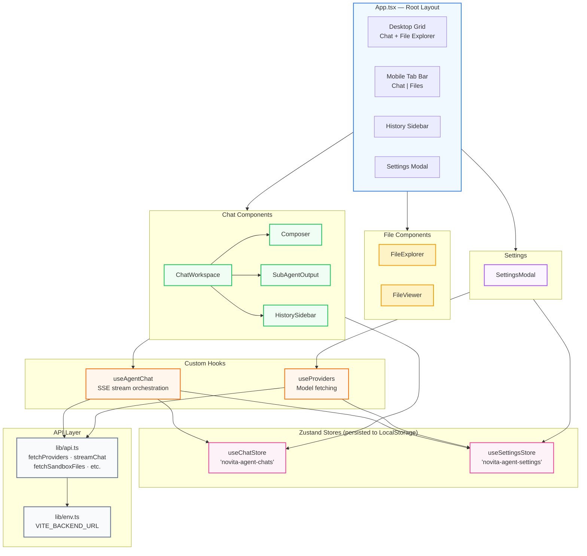
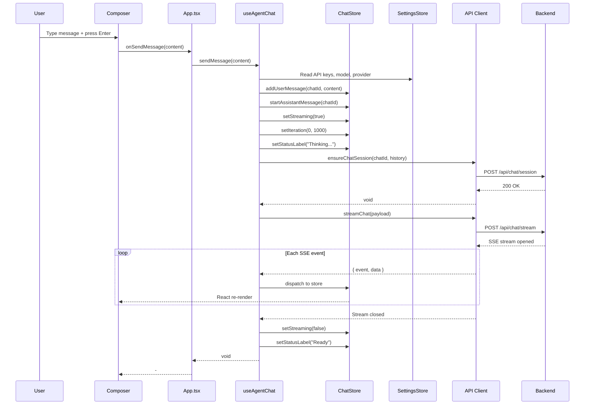
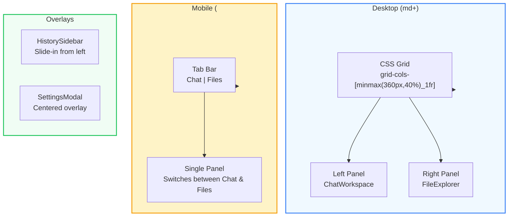

<div align="center">
  <pre style="
    font-family: 'SF Mono', 'Fira Code', 'Cascadia Code', monospace;
    font-size: 13px;
    line-height: 1.5;
    background: #0f172a;
    color: #e2e8f0;
    padding: 20px 24px;
    border-radius: 14px;
    display: inline-block;
    text-align: left;
    box-shadow: 0 8px 32px rgba(0,0,0,0.3);
    border: 1px solid #1e293b;
  "><span style="color:#38bdf8;">  ┌──────────────────────────────────────────────┐</span>
<span style="color:#38bdf8;">  │</span>  <span style="color:#fbbf24;">▌</span><span style="color:#6366f1;">╺━━━━━━━━━━━━━━━━━━━━━━━━━━━━━━━━━━━━━━━━</span><span style="color:#fbbf24;">▐</span>  <span style="color:#38bdf8;">│</span>
<span style="color:#38bdf8;">  │</span>  <span style="color:#fbbf24;">▌</span>  <span style="color:#fbbf24;font-weight:bold;">  OpenCurro Frontend</span>           <span style="color:#fbbf24;">▐</span>  <span style="color:#38bdf8;">│</span>
<span style="color:#38bdf8;">  │</span>  <span style="color:#fbbf24;">▌</span>  <span style="color:#94a3b8;">  React 19 · TypeScript 5.8 · Vite 7</span>  <span style="color:#fbbf24;">▐</span>  <span style="color:#38bdf8;">│</span>
<span style="color:#38bdf8;">  │</span>  <span style="color:#fbbf24;">▌</span><span style="color:#6366f1;">╺━━━━━━━━━━━━━━━━━━━━━━━━━━━━━━━━━━━━━━━━</span><span style="color:#fbbf24;">▐</span>  <span style="color:#38bdf8;">│</span>
<span style="color:#38bdf8;">  └──────────────────────────────────────────────┘</span>

  <span style="color:#22c55e;">▸</span> <span style="color:#94a3b8;">Dev:</span> <span style="color:#f97316;">npm run dev</span>
  <span style="color:#22c55e;">▸</span> <span style="color:#94a3b8;">Build:</span> <span style="color:#f97316;">npm run build</span>
  <span style="color:#22c55e;">▸</span> <span style="color:#94a3b8;">Port:</span> <span style="color:#f97316;">5173</span>
</pre>
</div>

---

## Architecture



---

## Project Structure

```
frontend/
├── src/
│   ├── main.tsx                    # React 19 StrictMode entry point
│   ├── App.tsx                     # Root layout (desktop/mobile, sidebar, settings)
│   ├── index.css                   # Tailwind v4 + custom theme (warm/light)
│   ├── vite-env.d.ts               # Vite env type declarations
│   ├── app/
│   │   └── routes/route.ts        # Route constants
│   ├── types/
│   │   ├── chat.ts                 # ChatRecord, UiMessage, ToolChip, SubAgentChip
│   │   ├── provider.ts             # ProviderMetadata, ProviderModel, ProviderSettings
│   │   └── sandbox.ts              # FileTreeNode, SandboxFilesResponse
│   ├── lib/
│   │   ├── api.ts                  # Backend API client + SSE stream parsing
│   │   ├── env.ts                  # VITE_BACKEND_URL configuration
│   │   └── utils.ts                # cn() utility (clsx + tailwind-merge)
│   ├── hooks/
│   │   ├── useAgentChat.ts         # SSE stream orchestration & store dispatch
│   │   └── useProviders.ts         # Provider catalog & model loading
│   ├── store/
│   │   ├── useChatStore.ts         # Zustand store: messages, tools, streaming state
│   │   └── useSettingsStore.ts     # Zustand store: API keys, models, preferences
│   ├── utils/
│   │   └── id.ts                   # ID generator (nanoid-style)
│   └── components/
│       ├── chat/
│       │   ├── ChatWorkspace.tsx    # Message list + tool output renderers
│       │   ├── Composer.tsx         # Input area with iteration display
│       │   ├── HistorySidebar.tsx   # Chat history list (create/delete)
│       │   └── SubAgentOutput.tsx   # Modal for sub-agent activity
│       ├── files/
│       │   ├── FileExplorer.tsx     # Tree-based sandbox file browser
│       │   └── FileViewer.tsx       # Inline code viewer/editor with save
│       ├── settings/
│       │   └── SettingsModal.tsx    # Full settings: API keys, models, sandbox
│       └── ui/
│           └── button.tsx          # shadcn/ui Button component
├── public/
│   └── _redirects                  # SPA redirect rules
├── package.json
├── vite.config.ts                  # Vite config (React, Tailwind, proxy, alias)
├── tsconfig.json                   # Root TypeScript config
├── tsconfig.app.json               # App TypeScript config
├── tsconfig.node.json              # Node/Vite TypeScript config
├── components.json                 # shadcn/ui configuration
└── eslint.config.js                # ESLint configuration
```

---

## Component Tree

```mermaid
graph TB
    APP["`**App.tsx**`"]

    APP --> HSIDEBAR["HistorySidebar<br/>Chat history management"]
    APP --> CHATWS["ChatWorkspace<br/>Main chat panel"]
    APP --> FILEEX["FileExplorer<br/>Sandbox file browser"]
    APP --> SETMODAL["SettingsModal<br/>Configuration modal"]

    CHATWS --> COMPOSER["Composer<br/>Text input + iteration display"]
    CHATWS --> SUBOUTPUT["SubAgentOutput<br/>Sub-agent modal"]
    CHATWS --> TOOLOUT["Tool Output Renderers"]

    TOOLOUT --> TO["TerminalOutput<br/>shall_tool"]
    TOOLOUT --> SVO["ShellViewOutput<br/>shell_view"]
    TOOLOUT --> LFO["ListFilesOutput<br/>list_files"]
    TOOLOUT --> WSO["WebSearchOutput<br/>web_search"]
    TOOLOUT --> FWO["FetchWebOutput<br/>fatch_web_urls"]
    TOOLOUT --> SRO["StrReplaceOutput<br/>str_replace"]
    TOOLOUT --> RB["ReasoningBlock<br/>reasoning"]
    TOOLOUT --> GENC["GenericChip<br/>file_read/write"]

    FILEEX --> TN["TreeNode<br/>Recursive file tree"]
    FILEEX --> FILEV["FileViewer<br/>Code viewer/editor"]

    SETMODAL --> PROV["Provider Config<br/>OpenRouter / Groq / NVIDIA"]
    SETMODAL --> NOV["Novita Sandbox<br/>API key + template"]
    SETMODAL --> WEB["Web Tools<br/>Tavily + Firecrawl"]
    SETMODAL --> SELECT["Model Selection<br/>Dropdown"]

    APP -.->|"Zustand"| CS["useChatStore<br/>'novita-agent-chats'"]
    APP -.->|"Zustand"| SS["useSettingsStore<br/>'novita-agent-settings'"]

    classDef main fill:#f0f9ff,stroke:#3b82f6,stroke-width:2px
    classDef chat fill:#f0fdf4,stroke:#22c55e,stroke-width:2px
    classDef files fill:#fef3c7,stroke:#f59e0b,stroke-width:2px
    classDef settings fill:#faf5ff,stroke:#a855f7,stroke-width:2px
    classDef output fill:#fdf2f8,stroke:#ec4899,stroke-width:2px
    classDef state fill:#fff7ed,stroke:#f97316,stroke-width:2px
    class APP main
    class HSIDEBAR,CHATWS,COMPOSER,SUBOUTPUT chat
    class FILEEX,TN,FILEV files
    class SETMODAL,PROV,NOV,WEB,SELECT settings
    class TO,TSVO,TLFO,TWSO,TFWO,TSRO,TRB,TGENC output
    class CS,SS state
```



---

## Data Flow: Message Sending



---

## Zustand Stores

### `useChatStore` (persisted as `novita-agent-chats`)

| State | Type | Description |
|---|---|---|
| `chats` | `ChatRecord[]` | All chat conversations |
| `activeChatId` | `string` | Currently active chat ID |
| `isStreaming` | `boolean` | Whether a stream is in progress |
| `statusLabel` | `string` | Current status text |
| `iterationCurrent` | `number` | Current iteration number |
| `iterationLimit` | `number` | Max iterations |

| Action | Description |
|---|---|
| `createChat()` | Create new empty chat |
| `deleteChat(id)` | Delete a chat |
| `setActiveChat(id)` | Switch active chat |
| `addUserMessage(id, content)` | Add user message to chat |
| `startAssistantMessage(id)` | Create placeholder assistant message |
| `appendAssistantToken(id, token)` | Stream token to current assistant message |
| `appendAssistantReasoning(id, token)` | Stream reasoning token |
| `finalizeAssistantMessage(id, content, reasoning?)` | Finalize assistant message |
| `markAssistantError(id, message)` | Mark message as errored |
| `addToolChip(id, tool)` | Add tool activity chip |
| `updateLastToolChip(id, updates)` | Update last tool chip (e.g., with result) |
| `addSubAgentChip(id, subAgent)` | Add sub-agent chip |
| `appendSubAgentToken(id, session, token)` | Stream sub-agent token |
| `addSubAgentToolChip(id, session, tool)` | Add sub-agent tool chip |
| `updateSubAgentStatus(id, session, status)` | Update sub-agent status |
| `setSandboxInfo(id, info)` | Set sandbox metadata |
| `replaceModelHistory(id, history)` | Replace model history |

### `useSettingsStore` (persisted as `novita-agent-settings`)

| State | Type | Description |
|---|---|---|
| `providerKeys` | `Record<ProviderId, string>` | LLM provider API keys |
| `providerBaseUrls` | `Record<ProviderId, string>` | Custom base URLs |
| `selectedProvider` | `ProviderId` | Active provider |
| `selectedModel` | `string` | Active model ID |
| `novitaApiKey` | `string` | Novita sandbox API key |
| `novitaTemplateId` | `string` | Optional sandbox template ID |
| `tavilyApiKey` | `string` | Tavily search API key |
| `firecrawlApiKey` | `string` | Firecrawl API key |
| `providerCatalog` | `ProviderMetadata[]` | Available providers |
| `modelsByProvider` | `Record<ProviderId, ProviderModel[]>` | Models per provider |

---

## TypeScript Types

### `ChatRecord`
```typescript
interface ChatRecord {
  id: string
  title: string
  createdAt: string
  updatedAt: string
  messages: UiMessage[]
  modelHistory: BackendMessage[]
  eventHistory: Record<string, unknown>[]
  sandbox?: SandboxInfo
}
```

### `UiMessage`
```typescript
interface UiMessage {
  id: string
  role: 'user' | 'assistant'
  content: string
  reasoning?: string
  createdAt: string
  status?: 'idle' | 'streaming' | 'error'
  toolChips?: ToolChip[]
  subAgentChips?: SubAgentChip[]
}
```

### `ToolChip`
```typescript
interface ToolChip {
  id: string
  name: string
  label: string
  filePath?: string
  command?: string
  sessionName?: string
  sessionNames?: string[]
  path?: string
  query?: string
  url?: string
  oldString?: string
  newString?: string
  ok?: boolean
  resultData?: Record<string, unknown>
}
```

### `SubAgentChip`
```typescript
interface SubAgentChip {
  id: string
  session: string
  agent: string
  output: string
  toolChips: ToolChip[]
  status: 'running' | 'completed' | 'error'
  errorMessage?: string
}
```

---

## Tool Output Components

Each tool has a dedicated visual component in `ChatWorkspace.tsx`:

| Component | Tool | Visual |
|---|---|---|
| `TerminalOutput` | `shall_tool` | Terminal icon, command display, stdout/stderr panes, exit code |
| `ShellViewOutput` | `shell_view` | Multi-session output with per-session status |
| `ListFilesOutput` | `list_files` | File listing with icons, sizes, directory indicators |
| `WebSearchOutput` | `web_search` | Search results as linked cards with descriptions |
| `FetchWebOutput` | `fatch_web_urls` | Fetched page content in scrollable pre block |
| `StrReplaceOutput` | `str_replace` | Old string (red) → new string (green) diff |
| `ReasoningBlock` | reasoning | Collapsible purple reasoning block |
| Generic chip | `file_read` / `file_write` | Pill badge with file path |

All tool outputs share the same pattern:
1. Collapsible header with icon, label, and status indicator
2. Status: `running...` (animated pulse), `done` (green), `error` (red)
3. Expandable detail pane with tool-specific content

---

## SSE Event Handling

The `streamChat` function in `lib/api.ts` handles SSE parsing:

```
event: token
data: {"value": "Hello"}

event: tool_call
data: {"name": "shall_tool", "command": "ls -la", ...}

event: tool_result
data: {"name": "shall_tool", "ok": true, "result": {...}}

event: message_complete
data: {"content": "Final response...", "iteration_count": 3}

event: done
data: {"ok": true}
```

The `useAgentChat` hook dispatches each event type to the appropriate store action:

| SSE Event | Store Action |
|---|---|
| `status` | `setStatusLabel()` |
| `iteration` | `setIteration()` |
| `sandbox` | `setSandboxInfo()` |
| `token` | `appendAssistantToken()` |
| `reasoning` | `appendAssistantReasoning()` |
| `tool_call` | `addToolChip()` |
| `tool_result` | `updateLastToolChip()` |
| `subagent_start` | `addSubAgentChip()` |
| `subagent_token` | `appendSubAgentToken()` |
| `subagent_tool_call` | `addSubAgentToolChip()` |
| `subagent_tool_result` | `updateLastSubAgentToolChip()` |
| `subagent_complete` | `updateSubAgentStatus('completed')` |
| `subagent_error` | `updateSubAgentStatus('error')` |
| `message_complete` | `finalizeAssistantMessage()` |
| `error` | `markAssistantError()` |
| `done` | `setStreaming(false)` |

---

## Styling

### Theme
- **Tailwind CSS v4** with CSS variables
- **Warm/light** color scheme
- Custom animations: `fadeUp`, `blinkWave`
- CSS variables for branding colors

### shadcn/ui
- **New York** style variant
- Custom Button component at `components/ui/button.tsx`
- Components use `cn()` utility (`clsx` + `tailwind-merge`)

### Key CSS Variables
```css
:root {
  --color-border: #e5e4e2;
  --color-bg: #fbfbfa;
  --color-text: #34322d;
  --color-accent: #ffc700;
  --color-purple: #a855f7;
}
```

---

## Responsive Layout



---

## API Client (`lib/api.ts`)

| Function | Method | Endpoint | Purpose |
|---|---|---|---|
| `fetchProviders()` | GET | `/api/providers` | List supported providers |
| `fetchModels()` | POST | `/api/providers/models` | Fetch models for provider |
| `ensureChatSession()` | POST | `/api/chat/session` | Create/hydrate session |
| `streamChat()` | POST | `/api/chat/stream` | SSE streaming chat |
| `fetchSandboxFiles()` | GET | `/api/sandbox/files` | List sandbox file tree |
| `fetchSandboxFileContent()` | GET | `/api/sandbox/file-content` | Read file content |
| `saveSandboxFileContent()` | POST | `/api/sandbox/file-content` | Write file content |

---

## Dev Proxy

Vite is configured to proxy `/api` requests to the backend:

```typescript
// vite.config.ts
server: {
  proxy: {
    '/api': {
      target: 'http://localhost:8000',
      changeOrigin: true,
    },
  },
}
```

This means during development, the frontend at `localhost:5173` can make API calls to `/api/*` without CORS issues.

---

## Dependencies

### Runtime
| Package | Version | Purpose |
|---|---|---|
| `react` | ^19.1.1 | UI framework |
| `react-dom` | ^19.1.1 | DOM renderer |
| `zustand` | ^5.0.8 | State management with persistence |
| `lucide-react` | ^0.542.0 | Icon library |
| `tailwindcss` | ^4.1.12 | Utility-first CSS |
| `@tailwindcss/vite` | ^4.1.12 | Tailwind Vite plugin |
| `tailwind-merge` | ^3.3.1 | Class name merging |
| `clsx` | ^2.1.1 | Conditional class names |
| `class-variance-authority` | ^0.7.1 | Component variants |
| `@radix-ui/react-slot` | ^1.2.3 | Primitive component |

### Dev
| Package | Version | Purpose |
|---|---|---|
| `typescript` | ~5.8.3 | TypeScript compiler |
| `vite` | ^7.1.2 | Build tool and dev server |
| `@vitejs/plugin-react` | ^5.0.0 | React plugin |
| `eslint` | ^9.33.0 | Linter |
| `tw-animate-css` | ^1.3.7 | Animation utilities |

---

## Commands

```bash
npm run dev         # Start dev server (port 5173)
npm run build       # TypeScript check + Vite build
npm run build:local # Same as build (alias)
npm run preview     # Preview production build
npm run lint        # ESLint check
```

---

## Key Conventions

### Import Alias
All imports use the `@` alias pointing to `src/`:
```typescript
import { ChatWorkspace } from '@/components/chat/ChatWorkspace'
import { useChatStore } from '@/store/useChatStore'
```

### File Naming
- Components: PascalCase (`ChatWorkspace.tsx`)
- Hooks: camelCase with `use` prefix (`useAgentChat.ts`)
- Stores: camelCase with `use` prefix + `Store` suffix (`useChatStore.ts`)
- Types: camelCase (`chat.ts`, `provider.ts`, `sandbox.ts`)
- Utilities: camelCase (`api.ts`, `env.ts`, `utils.ts`)

### State Pattern
- UI state: React `useState` and `useMemo`
- Persistent state: Zustand with `persist` middleware
- Ephemeral global state: Zustand without persistence
- Component-local state that doesn't need to survive reloads: `useState`
