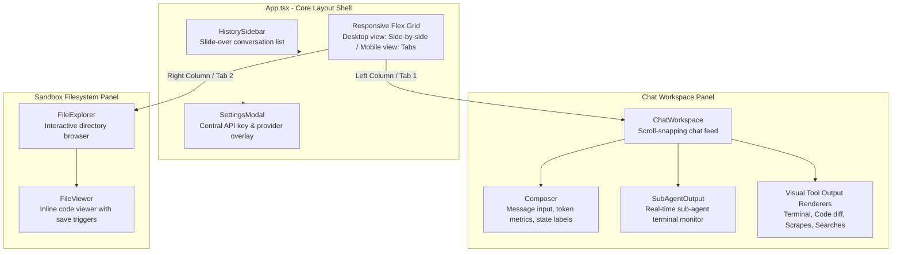
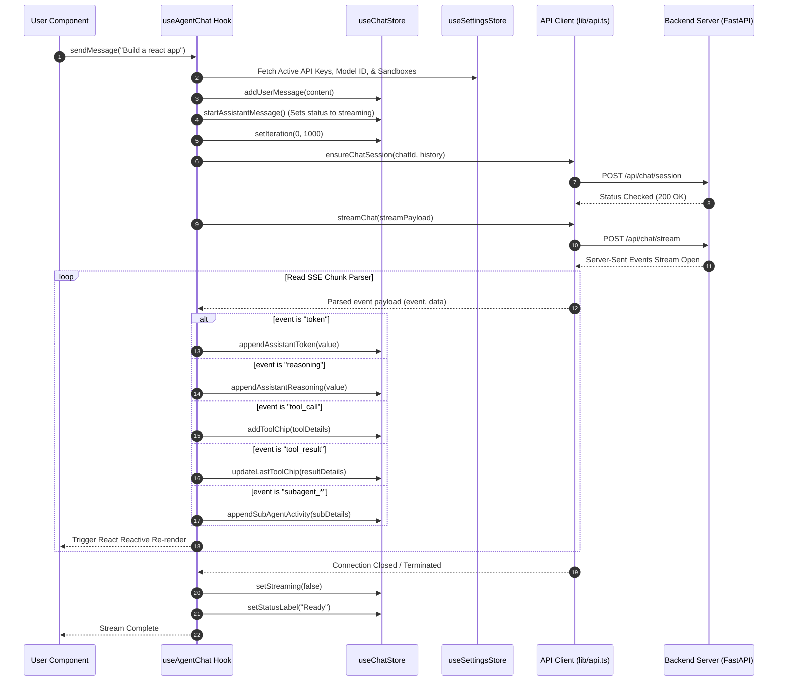

<div align="center">
  <pre style="
    font-family: 'SF Mono', 'Fira Code', 'Cascadia Code', monospace;
    font-size: 13px;
    line-height: 1.5;
    background: #0f172a;
    color: #e2e8f0;
    padding: 20px 24px;
    border-radius: 14px;
    display: inline-block;
    text-align: left;
    box-shadow: 0 8px 32px rgba(0,0,0,0.3);
    border: 1px solid #1e293b;
  "><span style="color:#38bdf8;">  ┌──────────────────────────────────────────────┐</span>
<span style="color:#38bdf8;">  │</span>  <span style="color:#fbbf24;">▌</span><span style="color:#6366f1;">╺━━━━━━━━━━━━━━━━━━━━━━━━━━━━━━━━━━━━━━━━</span><span style="color:#fbbf24;">▐</span>  <span style="color:#38bdf8;">│</span>
<span style="color:#38bdf8;">  │</span>  <span style="color:#fbbf24;">▌</span>  <span style="color:#fbbf24;font-weight:bold;">  OpenCurro Frontend Dashboard</span>  <span style="color:#fbbf24;">▐</span>  <span style="color:#38bdf8;">│</span>
<span style="color:#38bdf8;">  │</span>  <span style="color:#fbbf24;">▌</span>  <span style="color:#94a3b8;">  React 19 · Vite 7 · Zustand 5 · Tailwind</span>  <span style="color:#fbbf24;">▐</span>  <span style="color:#38bdf8;">│</span>
<span style="color:#38bdf8;">  │</span>  <span style="color:#fbbf24;">▌</span><span style="color:#6366f1;">╺━━━━━━━━━━━━━━━━━━━━━━━━━━━━━━━━━━━━━━━━</span><span style="color:#fbbf24;">▐</span>  <span style="color:#38bdf8;">│</span>
<span style="color:#38bdf8;">  └──────────────────────────────────────────────┘</span>

  <span style="color:#22c55e;">▸</span> <span style="color:#94a3b8;">Framework:</span> <span style="color:#38bdf8;">React 19 (TypeScript 5.8)</span>
  <span style="color:#22c55e;">▸</span> <span style="color:#94a3b8;">Build Tool:</span> <span style="color:#6366f1;">Vite 7</span>
  <span style="color:#22c55e;">▸</span> <span style="color:#94a3b8;">State Store:</span> <span style="color:#ec4899;">Zustand 5 (Persisted)</span>
</pre>
</div>

---

## 🎨 Overview & Workspace Layout

The OpenCurro frontend is a responsive developer dashboard engineered to provide rich real-time visual tracking of autonomous agent tasks.

It splits the desktop workspace into two primary panels:
1. **The Chat Workspace (Left Pane)**: Visualizes model prompt streams, collapsible tool execution output chips, and deep sub-agent logs.
2. **The Sandbox Workspace (Right Pane)**: An interactive filesystem explorer allowing users to inspect folder structures, view files, edit source code, and save changes back to the active sandbox in real time.

On small screens and mobile devices, a bottom navigation tab bar converts the workspace into dedicated **Chat** and **Files** views.



---

## 🔁 Real-Time Message Dispatch & SSE Integration

Managing Server-Sent Events (SSE) stream responses requires strict state synchronization. The application delegates stream handling to a custom hook, `useAgentChat`, which reads settings, updates Zustand chat records, parses the API readable stream chunk-by-chunk, and updates UI nodes.



---

## 🗄️ Application State Store Specifications

The client application manages and persists state across browser reloads using two isolated **Zustand 5** stores backed by the `persist` middleware.

### 1. Chat Store (`useChatStore`)
Saved in browser storage as `novita-agent-chats`.

| State / Action Field | Type / Signature | Purpose |
|---|---|---|
| `chats` | `ChatRecord[]` | Complete history of chat interactions, sandbox metadata, and model outputs. |
| `activeChatId` | `string` | ID of the active chat. |
| `isStreaming` | `boolean` | Flag used to disable buttons, composer inputs, and settings modifications during active streams. |
| `statusLabel` | `string` | Real-time status label shown in the input composer (e.g., "Initializing Sandbox...", "Thinking..."). |
| `iterationCurrent` | `number` | The current run-loop iteration count. |
| `iterationLimit` | `number` | The maximum allowed model turns before automatic loop termination. |
| `createChat` | `() => void` | Spawns a new workspace chat. |
| `deleteChat` | `(id: string) => void` | Disposes of a chat record. |
| `addUserMessage` | `(id: string, content: string) => void` | Appends a user query node to history. |
| `addToolChip` | `(id: string, tool: ToolChip) => void` | Appends an active execution card into the streaming message. |
| `updateLastToolChip`| `(id: string, updates: Partial<ToolChip>) => void` | Merges the output payload or exit status code of an completed tool. |

### 2. Settings Store (`useSettingsStore`)
Saved in browser storage as `novita-agent-settings`.

| State / Action Field | Type / Signature | Purpose |
|---|---|---|
| `providerKeys` | `Record<ProviderId, string>` | Client-managed API keys for OpenRouter, Groq, and NVIDIA NIM. |
| `providerBaseUrls` | `Record<ProviderId, string>` | Custom override URLs for OpenAI-compatible proxies. |
| `selectedProvider` | `ProviderId` | Currently active LLM provider. |
| `selectedModel` | `string` | Selected inference model. |
| `novitaApiKey` | `string` | Novita sandbox API key. |
| `novitaTemplateId` | `string` | Optional sandbox template UUID (e.g., specific Linux environments). |
| `tavilyApiKey` | `string` | Optional Tavily Web search token. |
| `firecrawlApiKey` | `string` | Optional Firecrawl webpage extraction token. |
| `providerCatalog` | `ProviderMetadata[]` | Loaded list of supported LLM providers. |
| `modelsByProvider` | `Record<ProviderId, ProviderModel[]>` | List of available models per provider. |

---

## 🛠️ Rich Visual Tool Chips

Rather than displaying raw JSON strings, the dashboard parses incoming tools and renders rich visual interfaces inside the conversation feed.

```
┌────────────────────────────────────────────────────────┐
│  [icon] Terminal: python build.py                      │
├────────────────────────────────────────────────────────┤
│  STATUS: done (Exit Code 0)                            │
│                                                        │
│  stdout:                                               │
│  ┌──────────────────────────────────────────────────┐  │
│  │ Checking code standards...                       │  │
│  │ Compiled application bundle successfully!       │  │
│  └──────────────────────────────────────────────────┘  │
└────────────────────────────────────────────────────────┘
```

The application provides dedicated output components:
- **`TerminalOutput` (`shall_tool`)**: Mimics a standard terminal interface. Renders command strings, running pulses, stdout/stderr output panes, and return codes.
- **`ShellViewOutput` (`shell_view`)**: Monitors active background execution handlers inside the sandbox.
- **`ListFilesOutput` (`list_files`)**: Renders directory lists with folder/file icons and sizes.
- **`WebSearchOutput` (`web_search`)**: Groups web search results into cards with linked URLs.
- **`FetchWebOutput` (`fatch_web_urls`)**: Renders extracted webpage contents in a structured preview block.
- **`StrReplaceOutput` (`str_replace`)**: Renders red (deleted) and green (inserted) string-replacement diffs.
- **`ReasoningBlock`**: Renders a collapsible reasoning block containing thinking paths (`reasoning_content`) extracted from supported reasoning models.

---

## 📁 Project Structure

```
frontend/
├── src/
│   ├── main.tsx                    # Mounts React strict application node
│   ├── App.tsx                     # Top-level workspace grid and layout routing
│   ├── index.css                   # Global styling directives and custom variables
│   ├── vite-env.d.ts               # Environment declarations
│   ├── app/
│   │   └── routes/                 # Single-page client-side paths
│   ├── types/                      # TypeScript definitions
│   │   ├── chat.ts                 # ChatRecord, UiMessage, ToolChip interfaces
│   │   ├── provider.ts             # Provider metadata interfaces
│   │   └── sandbox.ts              # File tree and node schemas
│   ├── lib/
│   │   ├── api.ts                  # Fetch wrappers & async stream readers
│   │   ├── env.ts                  # Vite environmental routing
│   │   └── utils.ts                # cn utility helper for class merging
│   ├── hooks/                      # Orchestration hooks
│   │   ├── useAgentChat.ts         # SSE reading & chat dispatching
│   │   └── useProviders.ts         # LLM configuration discovery
│   ├── store/                      # Zustand state persistence
│   │   ├── useChatStore.ts         # Chat records and active streams
│   │   └── useSettingsStore.ts     # User API keys, models, and custom providers
│   ├── utils/
│   │   └── id.ts                   # Secure runtime ID generators
│   └── components/                 # Component tree
│       ├── chat/
│       │   ├── ChatWorkspace.tsx   # Custom message nodes and tool chip renderers
│       │   ├── Composer.tsx        # Structured user input bar
│       │   ├── HistorySidebar.tsx  # Dynamic side-drawer history list
│       │   └── SubAgentOutput.tsx  # Specialized sub-agent execution window
│       ├── files/
│       │   ├── FileExplorer.tsx    # Tree directory browser
│       │   └── FileViewer.tsx      # Inline code viewer & local saving interface
│       ├── settings/
│       │   └── SettingsModal.tsx   # Settings modal for API key management
│       └── ui/                     # Generic form elements
└── package.json                    # Project metadata & npm scripts
```

---

## 🚀 Development Workflow

To boot the frontend dev server, run the following commands:

```bash
# Navigate to the frontend workspace
cd frontend

# Install package dependencies
npm install

# Start Vite server with live reload proxy
npm run dev
```

### Build & Production Output
To compile the TypeScript project into optimized, static browser assets, execute:

```bash
npm run build
```

The resulting assets are written to `frontend/dist/`. In production, the backend serves these assets statically from the `dist/` root, keeping the entire application within a single network container footprint.
